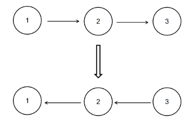
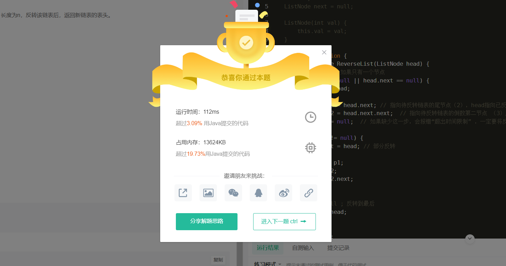

> 题目链接：https://www.nowcoder.com/practice/75e878df47f24fdc9dc3e400ec6058ca?tpId=117&tqId=37777&rp=1&ru=/exam/oj&qru=/exam/oj&sourceUrl=%2Fexam%2Foj%3Fpage%3D1%26tab%3D%25E7%25AE%2597%25E6%25B3%2595%25E7%25AF%2587%26topicId%3D117&difficulty=undefined&judgeStatus=undefined&tags=&title=

## 描述

给定一个单链表的头结点pHead(该头节点是有值的，比如在下图，它的val是1)，长度为n，反转该链表后，返回新链表的表头。

数据范围： 0≤*n*≤1000

要求：空间复杂度*O*(1) ，时间复杂度*O*(*n*) 。

如当输入链表{1,2,3}时，

经反转后，原链表变为{3,2,1}，所以对应的输出为{3,2,1}。

以上转换过程如下图所示：



## 示例1

输入：

```
{1,2,3}
```

返回值：

```
{3,2,1}
```

## 示例2

输入：

```
{}
```

返回值：

```
{}
```

说明：

```
空链表则输出空                  
```


## 解答

```java
import java.util.*;
/*
public class ListNode {
    int val;
    ListNode next = null;

    ListNode(int val) {
        this.val = val;
    }
}*/
public class Solution {
    public ListNode ReverseList(ListNode head) {
//         空链表
        if (head == null) {
            return head;
        }
        ListNode p1 = head.next; // 指向待反转链表的尾节点（2），head指向已反转的头节点（1），反转后 2-》1
        ListNode p2 = head.next.next;  // 指向待反转链表的倒数第二节点 （3）用于链表不断连
        head.next = null;  // 如果缺少这一步，会报错“超出时间限制” ，一定要将反转后的链表尾指针指向null
        
        while (p2 != null) {
            p1.next = head; // 部分反转
            
            head = p1;
            p1 = p2;
            p2 = p2.next;
        }
        
//        p2 == null ; 反转到最后
        p1.next = head;
        head = p1;
        
       return head; 
    }
}
```

## 分析情况

1. 反转空链表 ---- 返回head
2. 反转只有一个元素的链表 ---- 返回head
3. 反转有两个以上元素的链表

## 运行结果

