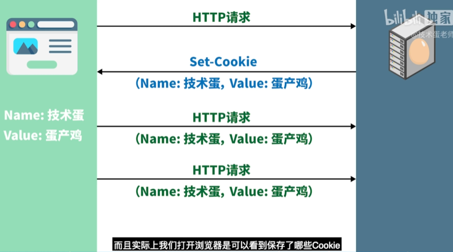
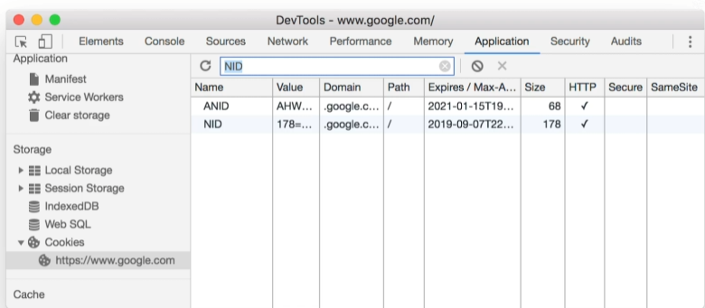
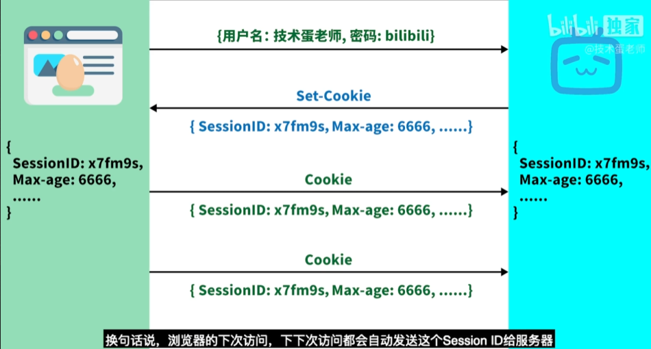
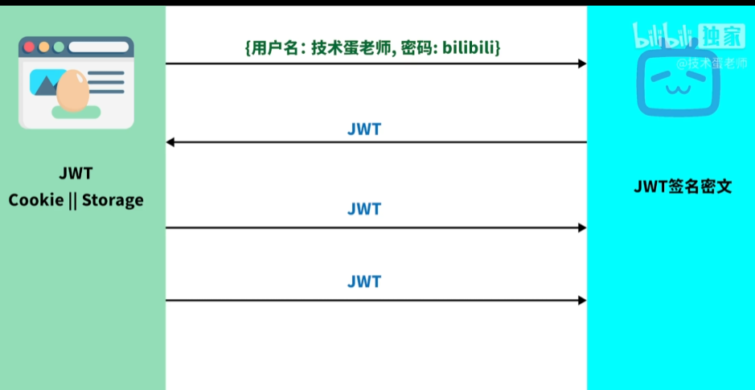
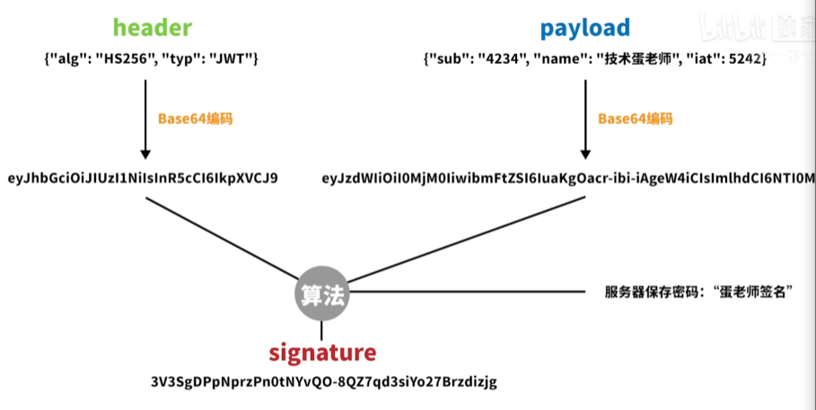

下面这位博主的视频讲解通俗易懂，本文内容也是在该视频的基础上进行梳理，可供参考：

Cookie、Session、Token究竟区别在哪？如何进行身份认证，保持用户登录状态？

https://www.bilibili.com/video/BV1ob4y1Y7Ep?spm_id_from=333.1007.top_right_bar_window_history.content.click&vd_source=bb5470bf26d0ba6f7869d61cafcf5a24

以bilibili登录为例

进入登录界面，输入用户名和密码后，很长一段时间都不用再重新到登陆页面输入账号密码。这种保存登录状态的方式是如何实现的呢？

众所周知，http是无状态的，即这次访问服务器，关闭网页后，再次访问服务器，服务器是没有意识到又是你来访问的。

cookie可以实现每次请求自动带数据传递给浏览器。即下次登录无需再输入用户名和密码，而是通过将cookie放入请求头，自动在请求时由cookie携带用户信息，实现保存登录状态。

### cookie的流程

简要来说，cookie是保存在浏览器的数据，它存储了用户名和密码，以实现记录登录状态。同时cookie具有有效时常，超过时长后清除原来的cookie，下次登录时需要重新输入用户名密码，新建cookie保存信息，以记录登录状态。

cookie的核心：每个请求都会携带cookie发送给服务器。（cookie放在请求头)

#### 浏览器中可以查看cookie

缺陷：由于cookie直接把用户信息存储在浏览器，只要电脑被黑，用户信息就会泄露，因此出现session技术。

### Session会话(基于cookie的session)

相当于把原来cookie浏览器端保存的用户名和密码换成服务器端数据库中的sessionId（由服务器产生的没有规律的字符串）。即cookie中不保存用户名密码，而是sessionId和会话结束事件Max-age。

缺陷：由于用户群体迅速扩张，在特定时间有大量用户访问服务器的时候，服务器需要保存的sessionId数量迅速增长，会造成服务器超载

JWT（Json Web Token）

服务器生成JWT，存储对JWT签名的密文，不存储JWT。JWT传递给浏览器存储（cookie或storage的形式存储）

#### JWT的组成

header：声明用什么算法来生成签名

payload：存储有效期等数据

signature：签名的信息

