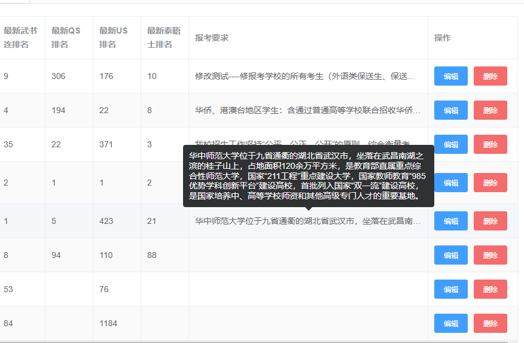

## 实现效果




## 代码

el-table

```html
          <el-table-column
            prop="school_requirments"
            label="报考要求"
            min-width="400"
          >
            <template slot-scope="scope">
              <el-tooltip
                class="item"
                effect="dark"
                placement="top"
              >
                <!-- 显示 mouseover 后的全部内容 -->
                <div
                  slot="content"
                  class="eplise"
                  v-html="scope.row.school_requirments"
                />
                  <!-- 在表格中显示省略后的文字 -->
                <div class="oneLine">{{ scope.row.school_requirments }}</div>
              </el-tooltip>
            </template>
          </el-table-column>
```


CSS样式

```css
// 用于隐藏 el-table 中过多的文字内容
.oneLine {
  overflow: hidden;
  white-space: nowrap;
  text-overflow: ellipsis;
}
.eplise {
  font-size: 14px;
  width: 400px;
}
```


## 参考资料

[Element UI 表格 show-overflow-tooltip 设置宽度以及内容换行](https://blog.csdn.net/ShIcily/article/details/109447445)
