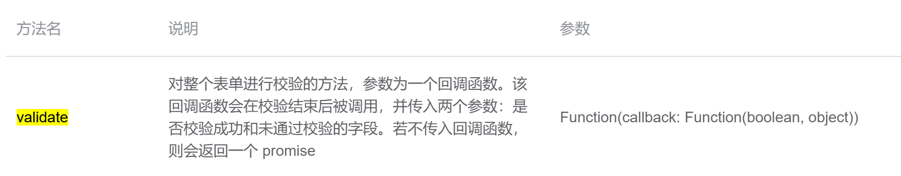

[TOC]


## 表单元素

~~~vue
    <el-form>
~~~


#### 数据form对象

form: {}

~~~javascript
  data() {
    return {
      // 表单数据结构
      form: {
        school_code: '', // 学校编号
        school_id: '', // 学校id
        school_name: '', // 学校名
      }
      }
    }
~~~

#### :model 用于表单第一层验证，显示红色 警告语

如果想做表单验证是必须要写的！

目前el-form的[model](https://so.csdn.net/so/search?q=model&spm=1001.2101.3001.7020)属性主要用表单验证的，也就是配合el-form的rules和el-form-item的prop来使用的，如果不写model，然后验证的话，会提示缺少model，导致无法验证成功。

**:model的作用：主要是为了配合表单验证。**

~~~html
    <el-form
      style="overflow-y: auto; height: 485px; margin-top: 10px"
      label-width="150px"
      :model="form"
    >
~~~

## 表单数据绑定

v-model ： el-form-item内部的每个表单项.即使关闭表单，再次打开时，上次输入的内容仍在。

~~~vue
      <el-form-item label="学校名称">
        <el-input v-model="form.school_name" class="input_box" />
      </el-form-item>
      <el-form-item label="学校等级">
        <el-input v-model="form.school_type" class="input_box" />
      </el-form-item>
~~~


## 表单校验第一步（三剑客）

:model : el-form     配合表单校验

:rules: el-form      指定表单对象和校验规则{}

props: el-form-item      指定输入框对应哪一个校验规则

#### html

~~~vue
    <el-form
      style="overflow-y: auto; height: 485px; margin-top: 10px"
      label-width="150px"
      :rules="rules"
      :model="form"
    >
      <el-form-item label="学校编号" prop="school_code">
        <el-input v-model="form.school_code" class="input_box" />
      </el-form-item>
~~~

#### js

```javascript
      // 表单验证
      rules: {
        school_code: [
          { required: true, message: '请输入学校编号', trigger: 'blur' }
        ]
      }
```

问题：只使用验证三剑客是无法对未验证通过的内容进行提交拦截的。也就是说，验证三剑客只不过是在为满足表单验证要求时，在页面显示红色警示语，只要点击了提交按钮，仍然会进行提交表单。并没有实现完整的表单验证过程。

解决：验证不通过拒绝提交请求。

## 表单校验第二步 validate()

ref获取el-form对象，调用el-form对象的validate方法进行拦截，如果验证成功则执行后面的提交请求代码，验证失败则不提交请求，并且弹出警告信息。即验证失败后代码不会往下执行。

1 定义el-form对象的ref名称

获得dom对象，此处用于获得表单el-form对象，为了调用el-form的validate验证方法

~~~vue
    <el-form
      ref="form"
      style="overflow-y: auto; height: 485px; margin-top: 10px"
      label-width="150px"
    >
~~~

2 通过ref获取对象

~~~ vue
this.$refs.form
~~~

3 调用el-form的validate方法

有两种使用validate的方法

方法一：官网（传入回调函数）

~~~javascript
    onSave() {
      this.$refs.form.validate((valid) => {
        if (valid) {
          alert('submit')
        } else {
          alert('submit error')
          return false // 表单校验不通过，不继续往下执行
        }
      })

      console.log(this.form)
    }
~~~

方法二：



针对"若不传入回调函数，则会返回一个 promise"，使用async await

~~~javascript
    async onSave() {
      try {
        await this.$refs.form.validate()
      } catch (error) {
        alert(error)
      }
    }
~~~

