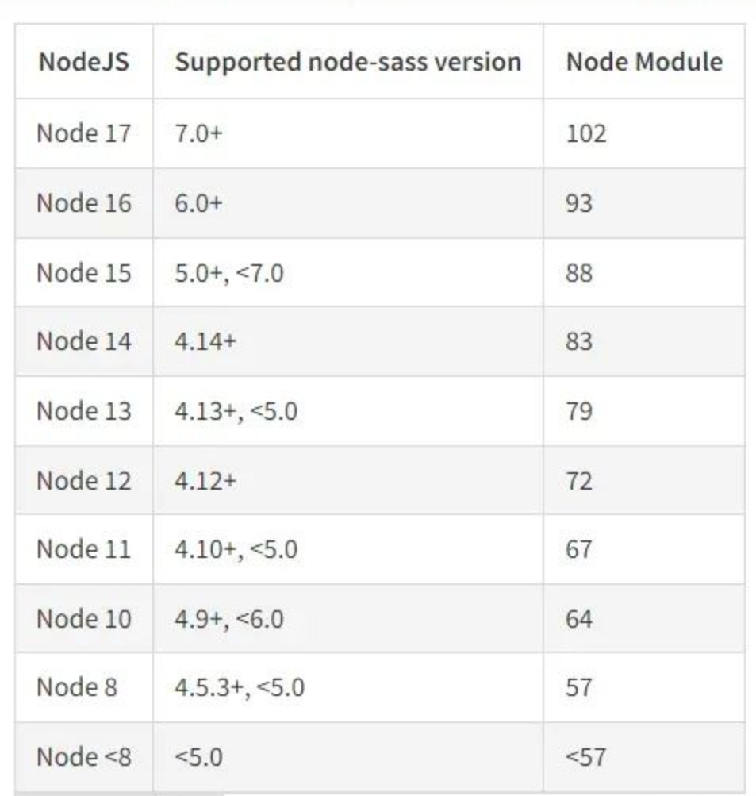

# node、node-sass、sass-loader的版本问题


## 前言

最近老师又接了一个vue3的后台管理系统项目，需要在已有的项目基础上进行一些细微改动。由于目前在做的是vue2的后台管理系统，并且也不太了解vue3的相关语法，所以周末先阅读之前的代码，我认为边欣赏页面边看代码更好理解，于是尝试能不能在本机上跑通该项目。之后便遇到了一系列挫折.....

## 1 寻找项目启动方式

package.json

~~~
  "scripts": {
    "serve": "vue-cli-service serve",
    "build": "vue-cli-service build"
  },
~~~

启动方式

~~~
npm run serve
~~~

## 2 版本不对应报错

老项目的package.json中安装的node-sass和sass-loader是如下版本

~~~
    "node-sass": "^7.0.1",
    "sass-loader": "^7.0.0",
~~~

刚开始显示版本不对应，我根据错误提示在网页上所有得知是node.js版本问题，当时我的node.js版本为16，而node-sass 7的版本对应node17，于是我使用nvm版本管理工具下载node17并使用。但仍旧报错。

仔细查看报错提示，发现是node-sass和sass-loader的版本不对应，根据网上的显示进行如下操作。

1. 先卸载旧的依赖

   ~~~
   npm uninstall node-sass sass-loader
   ~~~

2. 切换使用node16 ，因为17版本有一些问题，我还是选择以前的node16

   ~~~
   nvm use 16.15.1
   ~~~

3. 查找与node16匹配的node-sass和sass-loader版本，并安装

   npm install node-sass@6.0.1  sass-loader@10.0.1 --save

   ```
       "node-sass": "^6.0.1",
       "sass-loader": "^10.0.1"
   ```


再次运行，Fine！！成功！

## 总结

首先需要当前的node版本，寻找与之对应的node-sass版本，而node-sass又有与之对应的sass-loader版本。但是网络上关于node-sass和sass-loader版本对应信息较少，因此`先找node-sass和sass-loader版本对应关系，再找node-sass和node版本对应关系`。确定三者版本后，先切换node版本，然后再同时安装node-sass和sass-loader。

## 附件

### node与node-sass版本对应关系




### node-sass与sass-loader版本对应关系

~~~
sass-loader 4.1.1，node-sass 4.3.0
sass-loader 7.0.3，node-sass 4.7.2
sass-loader 7.3.1，node-sass 4.7.2
sass-loader 7.3.1，node-sass 4.14.1
sass-loader 10.0.1，node-sass 6.0.1
~~~


### 参考资料

1. npm install报错，尝试各种办法最后发现是node版本不对应 [https://zhuanlan.zhihu.com/p/459450895]