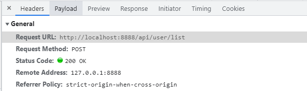
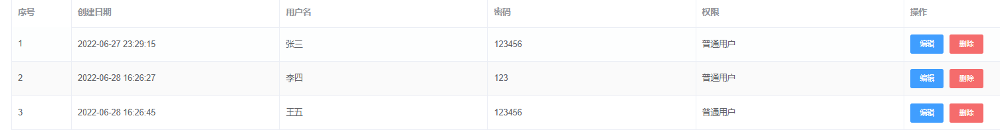

### 前后端分离-跨域

比如后端的请求接口：http://192.168.1.**):8080/user/login

由于前端与后端地址不同，不能够直接请求后端接口需要解决跨域问题，即用编写前端的电脑作为请求代理。

1. vue,config.js 的proxy配置跨域代理
2. 设置请求的基地址为/api
3. api实例

vue,config.js 的proxy配置

~~~javascript
  devServer: {
    // 代理配置 - 解决跨域问题（前端和后端接口不在同一域名下
    port: port,
    open: true,
    overlay: {
      warnings: false,
      errors: true
    },
    proxy: {
      '/api': { // 前端访问基地址
        target: 'http://192.168.1.**:8080', // 后端地接口地址
        changeOrigin: true, // 是否跨域
        pathRewrite: { // 如果接口本身没有/api需要通过pathRewrite来重写了地址
          '^/api': '' // 这里一定要重写为空（因为后端接口没有/api路径，直接才ip后接的接口）
            //这里理解成用‘/api’代替target里面的地址，组件中我们调接口时直接用/api代替
          // 比如我要调用'http://0.0:300/user/add'，直接写‘/api/user/add’即可
        }
      }
    }
~~~

设置请求的基地址为/api

~~~javascript
import axios from 'axios'
// 创建一个axios实例
const service = axios.create({
  baseURL: '/api', // 设置axios请求的基础的基础地址(通过/api别名指定后端路由)
  timeout: 5000 // 定义5秒超时
})
~~~

api请求实例

~~~javascript
export function login(data) {
  return request({
    url: '/user/login',
    method: 'post',
    data
  })
}
~~~

network显示的请求接口为

虽然显示请求 http://localhost:8888/api/user/list，其实本地会转发http://192.168.1.**:8080/user/login 请求，即实现前端访问后端接口

### 父传子

##### 父组件点击编辑按钮，传递数据给子组件，子组件在表单内进行数据回显。

知识点：

1. 谁调用api获取数据？（父组件）
2. 父组件通过什么方式传数据给子组件？（:变量名=“变量名”）
3. 子组件怎么接收？（props）
4. 子组件怎么使用数据进行回显？（el-input中使用v-model）

父组件 el-table

子组件 el-dialog

触发：表格每一行都有一个用户编辑的操作，点击编辑按钮后，弹出子组件表单对话框，表单对话框进行该行数据回显。

假设：需求为全部用户信息表，每一行为一个用户的信息。父组件data中有一个form表示该行用户信息，子组件props中有一个form:{}用于接收父组件传来的用户的信息。

操作步骤：

1. 父组件调有api接口，根据id查询该用户的所有信息

2. this.form = userinfo // 父组件保存用户信息

3. <子组件 :form="form"/>  通过prop形式，将父组件得到的用户信息传递给子组件，子组件通过v-model绑定数据显示在el-input中

   ~~~html
         <el-form-item label="密码" prop="password">
           <el-input v-model="form.password" class="input_box" />
         </el-form-item>
   ~~~

   
