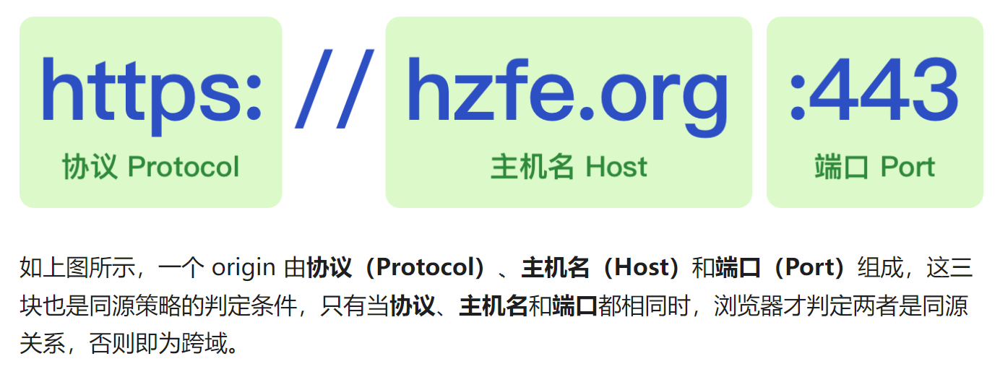

# 浏览器跨域

## 参考资料

1. [剑指前端Offer](https://febook.hzfe.org/awesome-interview/book1/browser-cross-origin)
2. [webpack之devServer配置](https://blog.csdn.net/hdchangchang/article/details/80112593)

## 相关问题

1. 什么是跨域？
2. 为什么会跨域？
3. 为什么有跨域限制？

## 回答关键点

1. 浏览器有跨域限制，服务端没有跨域
2. **浏览器**为了**请求安全**而引入的**基于同源策略**的安全特性

## 判定跨域

当页面和请求的协议（https）、主机（localhost）或端口（8080）不同时，浏览器判定两者不同源，从而产生跨域。

### 跨域的解决方案

#### 1.CORS (Cross-Origin Resource Sharing)

CORS 是目前最为广泛的解决跨域问题的方案。方案依赖**服务端/后端在响应头中添加** `Access-Control-Allow-*` 头，告知浏览器端通过此请求。

#### 2.反向代理

反向代理解决跨域问题的方案依赖`同源的服务端对请求做一个转发处理`，将请求从跨域请求转换成同源请求。

##### vue实现反向代理的具体实现方式

vue.config.js

> DevServer 是webpack开发服务器

~~~javascript
  devServer: {
    // 代理配置 - 解决跨域问题（前端和后端接口不在同一域名下
    host: '0.0.0.0',
    port: port,
    open: true,
    overlay: {
      warnings: false,
      errors: true
    },
    proxy: {
      '/api': {
        target: 'http://192.168.1.13:8080', // 后端接口
        changeOrigin: true, // 是否跨域
        pathRewrite: {
          '^/api': ''
        }
      }
    }
  },
~~~

理解

> 使用本地服务端代理跨域的API后端开发服务器。

- 假设你主机名为 localhost:8080 , 请求 API 的 url 是 `http://192.168.1.13:8080/user/list`
- '/api：如果点击某个按钮，触发请求 *API* 事件，这时请求 *url* 是`http://localhost:8080/api/user/list`
- changeOrigin：如果 true ，那么 `http://localhost:8080/api/user/list`变为 `http://192.168.1.13:8080/api/user/list` 。但还不是我们要的 url
- pathRewrite：重写路径。匹配 /api ，然后变为'' ，那么 url 最终为 `http://192.168.1.13:8080/user/list `。

总结：本地浏览器请求同源的服务端 `http://localhost:8080/api/user/list`,本地服务端请求API后端开发服务器，并且根据重写路径，用空字段代替/api字段，最终请求到实际的后端开发服务器 `http://192.168.1.13:8080/user/list `

创建axois实例

~~~javascript
// 创建一个axios实例
const service = axios.create({
  baseURL: '/api', // 设置axios请求的基础的基础地址(通过/api别名指定后端路由)
  timeout: 5000 // 定义5秒超时
})
~~~

