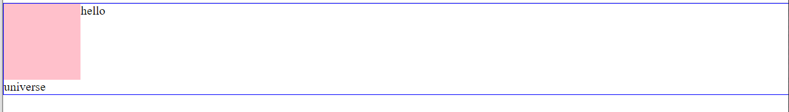
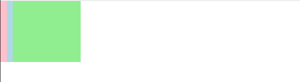
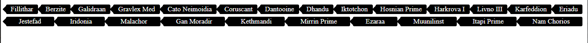
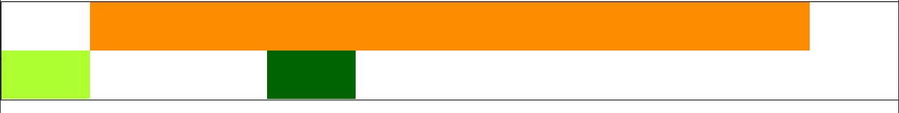

### 基础入门

#### HTML

##### **FED1** **表单类型**

请依次写出以下类型的输入框。

1. 类型为密码，默认值为"nowcoder"
2. 类型为复选框，且状态为已勾选

```html
  <body>
    <form>
      <!-- 密码输入框 -->
      <input type="password" value="nowcoder" />
      <!-- 复选框， 默认勾选 -->
      <input type="checkbox" checked />
    </form>
  </body>
```


##### **FED2** **表格结构**

请写出具有表格标题为"nowcoder"的2行3列表格结构。

~~~html
  <body>
    <table>
      <!-- caption  表格标题 -->
      <caption>
        nowcoder
      </caption>
      <!-- 两行 tr 三列 td 的表格 -->
      <tr>
        <td>11</td>
        <td>12</td>
        <td>13</td>
      </tr>
      <tr>
        <td>21</td>
        <td>22</td>
        <td>23</td>
      </tr>
    </table>
  </body>
~~~


##### **FED3** **图像标签属性**

请写出具有标题属性和代替文本属性的图片标签。

```html
  <body>
    <!-- title是全局属性，提供额外的提示信息，当鼠标滑动到该元素时，显示定义的提示。 -->
    <!-- alt是局部属性，尽可以用在img、input等元素中，提供在图片为载入或加载失败时的替代文本。 -->
    
  </body>
```


##### **FED4** **新窗口打开文档**

请写出可以在新窗口打开文档的a标签。

~~~html
  <body>
    <!--  target="_blank" 新打开一个页面，该页面为 http:// 空页面 -->
    <a href="http://" target="_blank"> 打开窗口 </a>
    <!-- 过 target="_blank" 打开的新窗口，跟原来的页面窗口共用一个进程。如果这个新页面执行了一大堆性能不好的 JavaScript 代码，
      占用了大量系统资源，那你原来的页面也会受到池鱼之殃。
     需要加上 rel="noopener" 或者 rel="noreferrer"。这样新窗口的 window.opener 就是 null 了，
     而且会让新窗口运行在独立的进程里，不会拖累原来页面的进程。-->
    <hr />
    <a href="http://www.baidu.com" target="_blank" rel="noreferrer">去百度</a>
  </body>
~~~


##### **FED5** **自定义列表**

请写出列表项为"nowcoder"且列表项内容也为"nowcoder"的自定义列表。

~~~html
  <body>
    <!-- 自定义列表 dl ; 列表项 dt ；列表项描述 dd -->
    <dl>
      <dd>nowcoder</dd>
      <dt>nowcoder</dt>
    </dl>
  </body>
~~~


扩展：无序列表、有序列表、自定义列表

**有序列表：**<ol> 表示有序列表，<li> 表示列表中的每一项，有序列表的前缀可以是大写字母和小写字母、数字、罗马数字等，默认使用阿拉伯数字编号。

**无序列表：**<ul> 表示无序列表，配合 <li> 实现，无序列表的前缀可以是实心圆、空心圆、实心正方形，默认使用实心圆符号显示。

**定义列表：**<dl> 与<dt>、<dd> 配合实现，<dt> 充当列表的标题，<dd> 是对 <dt> 的解释说明。自定义列表没有前缀，但有缩进。

[HTML中有序列表、无序列表、自定义列表的使用及三者之间的区别](https://baijiahao.baidu.com/s?id=1697352745558962922&wfr=spider&for=pc)

##### **FED73** **加粗文字**

使用一个标签将“牛客网”三个字加粗显示

~~~html
  <script>
    let p = document.getElementsByTagName('p')[0]
    // 获取第一个p元素
    p.innerHTML = p.innerText.replace('牛客网', '<strong>牛客网</strong>')
    // 用加上<strong>标签的文本替换
  </script>
  <body>
    <!-- 加粗文字  -->
    <p><strong>牛客网</strong>，程序员必备求职神器</p>
  </body>
~~~

扩展：[innerHTML和innerText的使用和区别](https://zhuanlan.zhihu.com/p/162718795)

##### **FED6** 语义化标签

请使用语义化标签创建头部标签且包含导航标签。
注意：只需在html模块填写标签结构，有且仅有一个头部标签和一个导航标签。

~~~html
  <body>
    <!-- 语义化标签 -->
    <header>
      <nav>导航</nav>
    </header>
  </body>
~~~

##### FED7 音频媒体标签属性

请写出具有控件功能的音频媒体标签。必须有 `controls`

~~~html
<audio controls>
    <source src="s.mp3" type="audio/mp3"/>
    audio
</audio>
~~~


##### FED8 视频媒体标签属性

请写出具有当视频的媒体数据加载期间发生错误时执行某个方法事件的视频媒体标签。

~~~html
  <body>
    <video controls onerror="a()">
      <source src="movie.mp4" type="video/mp4" />
    </video>
  </body>
~~~


#### CSS

##### FED9 CSS选择器——标签、类、ID选择器

请将html模块中字体内容是"红色"的字体颜色设置为"rgb(255, 0, 0)"，"绿色"设置为"rgb(0, 128, 0)"，"黑色"设置为"rgb(0, 0, 0)"，且字体大小都为20px。

~~~html
<html>
    <head>
        <meta charset=utf-8>
        <style type="text/css">
            /*补全代码*/
            div{
                font-size:20px
            }
            div:nth-child(1){
                color:rgb(255, 0, 0)
            }
            .green{
                color:rgb(0, 128, 0)
            }
            #black{
                color:rgb(0, 0, 0)
            }
        </style>
    </head>
    <body>
        <div >红色</div>
        <div class='green'>绿色</div>
        <div id='black'>黑色</div>
    </body>
</html>

~~~

##### FED10 CSS选择器——伪类选择器

请将html模块中ul列表的第2个li标签和第4个li标签的背景颜色设置成"rgb(255, 0, 0)"。

~~~html
<html>
    <head>
        <meta charset=utf-8>
        <style type="text/css">
            /*补全代码*/
            li:nth-child(2n){
                background-color: rgb(255, 0, 0)
            }
        </style>
    </head>
    <body>
        <ul>
            <li>1</li>
            <li>2</li>
            <li>3</li>
            <li>4</li>
        </ul>
    </body>
</html>
~~~

##### FED11 CSS选择器——伪元素

请给html模块的div元素加一个后伪元素，且后伪元素的宽度和高度都是20px，背景颜色为"rgb(255, 0, 0)"。

~~~html
<html>
    <head>
        <meta charset=utf-8>
        <style type="text/css">
          div::after {
            /* 不设置 content 属性，不显示元素 */
            content: '';
            width: 20px;
            height: 20px;
            background-color: rgb(255, 0, 0);
            /* 伪元素天生是行级元素所以要加display:block;来改变伪元素的行级元素结构 */
            /* 不设置 display 属性，不显示该元素 */
            display: block;
          }
        </style>
  </head>
  <body>
    <div></div>
  </body>
</html>

~~~


##### FED12 按要求写一个圆

请将html模块的div元素设置为一个半径是50px的圆，且边框为1px的黑色实线。
要求：

1. 圆角属性仅设置一个值
2. 圆角属性单位请使用px
   注意：由于圆角属性设置广泛且都可以实现题目效果，所以请按照要求规范书写。

~~~html
<html>
    <head>
        <meta charset=utf-8>
        <style type="text/css">
            /*补全代码*/
              div {
                border: 1px solid black;
                width: 100px;
                height: 100px;
                border-radius: 50px;
                /* border-radius: 50%; 也可以 */
              }
        </style>
    </head>
    <body>
        <div></div>
    </body>
</html>

~~~


##### FED13 设置盒子宽高

请将html模块类为"box"的div元素宽度和高度都设置为100px，且内间距为20px、外间距为10px。

~~~html
<html>
  <head>
    <meta charset="utf-8" />
    <style type="text/css">
      /*补全代码*/
      .box {
        width: 100px;
        height: 100px;
        /* 内边距 */
        padding: 20px;
        /* 外边距 */
        margin: 10px;
      }
    </style>
  </head>
  <body>
    <div class="box"></div>
  </body>
</html>

~~~

##### FED74 段落标识

~~~html
<html>
  <head>
    <meta charset="utf-8" />
  </head>

  <body></body>
  <!-- script 一定要放在 body 下面，不然获取不到 DOM元素  -->

  <!-- 方法一：innerHTML -->
  <script>
    let par = document.querySelector('body')
    console.log(par)
    par.innerHTML = '<p>牛客网是一个专注于程序员的学习和成长的专业平台。</p>'
  </script>

  <!-- 方法二：createElement 创建 DOM元素  -->
  <script>
    // 1 创建 p 标签节点
    let p = document.createElement('p')
    // 2 创建文本节点
    let text = document.createTextNode(
      '牛客网是一个专注于程序员的学习和成长的专业平台。'
    )
    // 3 把文件节点加入p标签中
    p.appendChild(text)
    // 4 把 p 标签追加到 body 上
    document.body.appendChild(p)
  </script>
</html>

~~~

##### **FED75** **设置文字颜色**

请使用嵌入样式将所有p标签设置为红色文字

~~~html
<html>
  <head>
    <meta charset="utf-8" />
  </head>
  <body>
    <p>欢迎来到牛客网</p>
    <p>在这里，我们为你提供了IT名企的笔试面试题库</p>
    <p>在这里，我们以题会友</p>
  </body>

  <script>
    let pArr = document.querySelectorAll('p')
    pArr.forEach((item) => {
      item.style.color = 'red'
    })
  </script>
</html>

~~~

##### **FED76** **圣诞树**

圣诞节来啦！请用CSS给你的朋友们制作一颗圣诞树吧~这颗圣诞树描述起来是这样的：
\1. "topbranch"是圣诞树的上枝叶，该上枝叶仅通过边框属性、左浮动、左外边距即可实现。边框的属性依次是：宽度为100px、是直线、颜色为green（未显示的边框颜色都为透明）
\2. "middleBranch"是圣诞树的中枝叶，该上枝叶仅通过边框属性即可实现。边框的属性依次是：宽度为200px、是直线、颜色为green（未显示的边框颜色都为透明）
\3. "base"是圣诞树的树干，该树干仅通过左外边距实现居中于中枝叶。树干的宽度、高度分别为70px、200px，颜色为gray。
注意：
\1. 上枝叶、树干的居中都是通过左外边距实现的
\2. 没有显示的边框，其属性都是透明（属性）
\3. 仅通过**border属性**完成边框的所有属性设置

~~~css
    <style type="text/css">
      .topbranch {
        width: 0px;
        height: 0px;
        /*
                * TODO: 上枝叶效果
                */
        /* 只有上面的树叶脱离文档流，下面树叶才会上移 */
        float: left;
        border: 100px solid green;
        border-left-color: transparent;
        border-right-color: transparent;
        border-top-color: transparent;
        margin-left: 100px;
      }
      .middleBranch {
        width: 0px;
        height: 0px;
        /*
                * TODO: 中枝叶效果
                */
        border: 200px solid green;
        border-left-color: transparent;
        border-right-color: transparent;
        border-top-color: transparent;
      }
      .base {
        /*
                * TODO: 树干效果
                */
        height: 200px;
        width: 70px;
        background-color: gray;
        /* 200中间枝叶的一半 - 树枝的一半 35px */
        margin-left: 165px;
      }
    </style>
~~~

~~~html
  <body>
    <section class="topbranch"></section>
    <section class="middleBranch"></section>
    <section class="base"></section>
  </body>
~~~


##### FED14 浮动和清除浮动

请将类为"left"的div元素和类为"right"的div元素在同一行上向左浮动，且清除类为"wrap"的父级div元素内部的浮动。

父盒子的高度由子节点撑开，宽度默认为整个屏幕

> 当子元素浮动时，父盒子没有高度,这样子元素不会撑开父盒子的高度,父盒子高度为0。

~~~css
    <style type="text/css">
      .wrap {
        /*补全代码*/
        background-color: blue;
        /*通过实现 BFC 清除浮动 */
        overflow: hidden;
      }
      .left {
        width: 100px;
        height: 100px;
        /*补全代码*/
        background-color: pink;
        float: left;
      }
      .right {
        width: 100px;
        height: 100px;
        /*补全代码*/
        background-color: green;
        float: left;
      }
    </style>
~~~

~~~html
  <body>
    <div class="wrap">
      <div class="left"></div>
      <div class="right"></div>
    </div>
  </body>
~~~

浮动前


当两个孩子节点都左浮动后，父盒子没有高度了


方法一：新增一个div孩子，样式清除浮动，但是需要多加一个节点

~~~html
    .clear {
    	clear: both;
    }

	<div class="wrap">
      <div class="left"></div>
      <div class="right"></div>
      <div class="clear"></div>
    </div>
~~~

方法二：触发父盒子的 BFC 

~~~css
      .wrap {
        /*补全代码*/
        background-color: blue;
        /*通过实现 BFC 清除浮动 */
        overflow: hidden;
      }
~~~

清除浮动后


##### FED15 固定定位

请将html模块类为"box"的div元素固定在视口的左上角。

~~~html
<html>
  <head>
    <meta charset="utf-8" />
    <style type="text/css">
      .box {
        width: 100px;
        height: 100px;
        /*补全代码*/
        background-color: pink;
        position: fixed;
        top: 0;
        left: 0;
      }
    </style>
  </head>
  <body>
    <div class="box"></div>
  </body>
</html>

~~~


##### FED18 CSS单位（一）

请将html模块中类为"box"的div元素的宽度和高度设置为自身字体大小的4倍。

> 考点：    
>
> em:默认基准点为父元素的字体大小，如果自身定义了字体大小，则按照自身来计算 ,若当前尺寸为10px,即1em=10px,则2em=20px;
>
> rem:相对于根元素 html 的字体大小

~~~html
<html>
  <head>
    <meta charset="utf-8" />
    <style type="text/css">
      .box {
        /*补全代码*/
        height: 4em;
        width: 4em;
      }
    </style>
  </head>
  <body>
    <div class="box"></div>
  </body>
</html>

~~~

##### **FED19** **CSS单位（二）**

请将html模块div元素的宽度和高度设置为html根元素字体大小的4倍。
注意：只需在css模块补全样式内容，请勿修改html模块。

~~~html
<html>
  <head>
    <meta charset="utf-8" />
    <style type="text/css">
      div {
        /*补全代码*/
        width: 4rem;
        height: 4rem;
      }
    </style>
  </head>
  <body>
    <div></div>
  </body>
</html>

~~~

*在html5中,默认字体大小是根据浏览器的不同来决定的,多数浏览器的默认字体大小为16px*;


#### ES5

##### FED20 基本数据类型检测

请补全JavaScript函数，要求以字符串的形式返回参数的类型。
注意：只需检测基本数据类型。

~~~js
function _typeof(value) {
  // 补全代码
  return typeof value
}

// 测试
_typeof(1) // number
_typeof(true) // boolean
_typeof('1') // string
_typeof([]) // object
_typeof({}) // object
~~~


##### FED21 检测复杂数据类型

请补全JavaScript函数，要求以Boolean的形式返回第一个参数是否属于第二个参数对象的实例。

~~~js
function _instanceof(left, right) {
  // 补全代码
  console.log(left instanceof right)
  return left instanceof right
}

//  测试
// instanceof判断一个对象是否是另一个对象的实例，而数字1是基本数据类型，不是对象
_instanceof(1, Number) // false
_instanceof(new Number(1), Number) // true

_instanceof('1', String) // false
_instanceof(new String('1'), String) // true

_instanceof(true, Boolean) // false
_instanceof(new Boolean(true), Boolean) // true

_instanceof([], Array) // true
_instanceof([], Object) // true

_instanceof({}, Object) // true

console.log(typeof a === 'undefined') // true
console.log(typeof a !== 'undefined') // false

~~~

扩展： typeof 和 instance 的区别

typeof: typeof是一个一元运算符，放在一个运算数之前，返回值是一个字符串，说明运算数的类型。可以使用typeof来确定一个变量是否存在。如：if(typeof(a)!=“undefined”)。

`if(typeof a !== “undefined”)` // true or false

instance 无论是什么引用类型 typeof 得值都是object，这时候就需要instanceof来检测某个对象是不是另一个对象的实例。**instanceof 运算符用来测试一个对象在其原型链中是否存在一个构造函数的prototype属性。用于判断一个变量是否某个对象的实例**。

##### FED22 数据类型转换

请补全JavaScript函数，要求以字符串的形式返回两个数字参数的拼接结果。
示例：

1. _splice(223,233) -> "223233"
2. _splice(-223,-233) -> "-223-233"

~~~js
function _splice(left, right) {
  // 补全代码
  return left.toString() + right.toString()
  // 或者 return String(left)+String(right)
}

console.log(_splice(233, 233)) // 233233
console.log(_splice(-233, -233)) // -233-233

~~~

##### FED23 阶乘

请补全JavaScript函数，要求返回数字参数的阶乘。
注意：参数为大于等于0的整数。

~~~js
function _factorial(number) {
  // 补全代码
  let res = 1
  while (number !== 0) {
    res *= number
    number--
  }
  return res
}
~~~

##### FED24 绝对值

请补全JavaScript函数，要求返回数字参数的绝对值。

~~~js
function _abs(number) {
  // 补全代码
  return Math.abs(number)
  // 或者 return number>0 ? number : -number
}
~~~

##### **FED58** **移除数组中的元素**

移除数组 arr 中的所有值与 item 相等的元素，直接在给定的 arr 数组上进行操作，并将结果数组返回

~~~js
function removeWithoutCopy(arr, item) {
  for (let i = 0; i < arr.length; ) {
    if (arr[i] === item) {
      arr.splice(i, 1)
    } else {
      i++
    }
  }
  return arr
}

let arr = [1, 2, 2, 3, 4, 2, 2]
let item = 2
console.log(removeWithoutCopy(arr, item)) //[ 1, 3, 4 ]

~~~


##### FED28 返回星期数

请补全JavaScript函数，要求以字符串的形式返回数字参数所对应的星期。
示例：
\1. _getday(1) -> "星期一"
\2. _getday(7) -> "星期天"

~~~js
function _getday(value) {
  // 补全代码
  switch (value) {
    case 1:
      return '星期一'
    case 2:
      return '星期二'
    case 3:
      return '星期三'
    case 4:
      return '星期四'
    case 5:
      return '星期五'
    case 6:
      return '星期六'
    case 7:
      return '星期天'
    default:
      return null // 如果没有与表达式相同的值，则执行该代码
  }
}

// 方法二
function _getday(value) {
  // 补全代码
  let arr = ['天', '一', '二', '三', '四', '五', '六']
  return `星期${arr[value % 7]}`
}
~~~

##### **ED30** **大写字符串**

请补全JavaScript函数，要求将字符串参数转换为大写字符串并返回。

~~~js
function _touppercase(string) {
    // 补全代码
    return string.toUpperCase()
}
~~~

**FED31** **对象属性键名**

请补全JavaScript函数，要求以数组的形式输出对象各个属性的键名。
示例：
\1. _keys({name:'nowcoder',age:7}) -> ['name','age']
注意：只需考虑对象属性均为原始数据类型的情况。

~~~js
function _keys(object) {
  // 补全代码
  // 方法一
  let arr = []
  for (let key in object) {
    arr.push(key)
  }
  return arr

  // 方法二
  return Object.keys(object)
}

let object = { name: 'nowcoder', age: 7 }
console.log(_keys(object))

~~~

##### **FED34** **去除字符串两端空格**

请补全JavaScript函数，要求去除参数字符串两端的空格并返回。

~~~j
function _trim(string) {
    // 补全代码
    return string.trim()
}
~~~

**FED35** **输出日期**

请补全JavaScript函数，要求以字符串的形式输出时间戳参数所对应的"年-月-日"。
示例：
\1. _date(1631159776311) -> '2021-9-9'

~~~js
function _date(number) {
    // 补全代码
    let date = new Date(number) 
    return `${date.getFullYear()}-${date.getMonth() + 1}-${date.getDate()}`
}
~~~

##### **FED37** **数组反转**

请补全JavaScript函数，要求将参数数组反转之后返回。

~~~js
function _reverse(array) {
    // 补全代码
    return array.reverse(array)
}
~~~

##### **FED39** **数组最大值**

请补全JavaScript函数，要求找到数组参数中的最大值并返回。
注意：数组中只包含数字。

~~~js
function _max(array) {
    // 补全代码
    let arr = array.sort((a,b)=>b - a)
    return arr[0]
}
~~~


##### **FED40** **搜索数字**

请补全JavaScript函数，要求以boolean的形式返回字符串参数中是否包含数字

~~~js
function _search(string) {
  // 补全代码
  return string.search(/[0-9]/) >= 0 ? true : false
}

~~~

##### **FED45** **整数反转**

请补全JavaScript函数，要求将整数参数反转之后输出。
示例：
\1. _reverse(0) -> 0
\2. _reverse(233) -> 332
\3. _reverse(-223) -> -322

##### **FED59** **添加元素**

在数组 arr 末尾添加元素 item。结果返回新的数组。

注意：不要直接修改数组 arr!!!   push() 会改变原数组

输入：

```
[1, 2, 3, 4],  10
```

输出：

```
[1, 2, 3, 4, 10]
```

~~~js
function append(arr, item) {
    return arr.concat([item])
}
~~~

**FED60** **删除数组最后一个元素**

删除数组 arr 最后一个元素。不要直接修改数组 arr，结果返回新的数组

~~~js
function truncate(arr) {
    return arr.slice(0,arr.length - 1)
}
~~~

##### **FED61** **添加元素**

在数组 arr 开头添加元素 item。不要直接修改数组 arr，结果返回新的数组

~~~js
function prepend(arr, item) {
    let res = arr.slice()
    res.unshift(item)
    return res
}
~~~

**FED62** **删除数组第一个元素**

删除数组 arr 第一个元素。不要直接修改数组 arr，结果返回新的数组

~~~js
function curtail(arr) {
    let res = arr.slice()
    res.shift()
    return res
}
~~~

**FED63** **数组合并**

合并数组 arr1 和数组 arr2。不要直接修改数组 arr，结果返回新的数组

~~~js
function concat(arr1, arr2) {
    let res = arr1.concat(arr2)
    return res
}

输入：
[1, 2, 3, 4], ['a', 'b', 'c', 1]
输出：
[1, 2, 3, 4, 'a', 'b', 'c', 1]
~~~

##### **FED64** **添加元素**

在数组 arr 的 index 处添加元素 item。不要直接修改数组 arr，结果返回新的数组

~~~js
function insert(arr, item, index) {
  let res = arr.slice()
  // res 数组 从index位置，删除0个元素，加入 item
  // 如果返回 res.splice 返回的是被删除的元素组成的数组
  res.splice(index, 0, item)
  return res
}

console.log(insert([1, 2, 3, 4], 'z', 2)) // [ 1, 2, 'z', 3, 4 ]

~~~

##### FED66 查找元素位置

在数组 arr 中，查找值与 item 相等的元素出现的所有位置

~~~js
function findAllOccurrences(arr, target) {
    let arr2 = []
    arr.forEach((item, index)=>{
        if(item == target){
            arr2.push(index)
        }
    })
    return arr2;
}

~~~

##### **FED68** **正确的使用 parseInt**

扩展： 进制转换

parseInt ( number, 进制数 ); 将任意进制 转换 为十进制

~~~js
parseInt(010,2)  // NaN  这是因为0开头的会被认为是八进制或十六进制
parseInt(10,2)   // 2   把二进制的10转为十进制 == 2
parseInt(14,8)   // 12  把八进制的14转为十进制 == 12

~~~

(num).toString (进制数)； 将十进制数字转换为任意进制

强调一下：后一个参数是转换的目标进制

例：

~~~js
(10).toString(16)   // 'a' 将十进制的10 转为 16进制的数
(10).toString(8)    //  '12' 将十进制的10 转为 8进制的数
~~~

其他进制转其他进制

~~~js
例 二进制的 1110 转为 16进制 的数
(parseInt(1110,2)).toString(16)   //  'e'
二进制的 1110 转十进制 = 14 ， 14 转为十六进制结果为 'e'
~~~

##### **FED47** **函数——参数对象**

请补全JavaScript函数，要求返回它的参数伪数组对象。

~~~js
function getArguments (a,b,c) {
    // 补充代码
    return arguments
}
~~~

#### **WebAPI**

**FED49** **JS动态创建节点**

请补全JavaScript函数，根据参数数组创建li元素。
要求：
\1. li元素的个数和数组的长度一样
\2. li元素的内容是数组中的每个元素
\3. 将创建的所有li元素插入到ul中

~~~html
<html>
  <head>
    <meta charset="utf-8" />
  </head>
  <body>
    <ul></ul>
  </body>
  <script type="text/javascript">
    function createLi(array) {
      // 补全代码
      let ul = document.querySelector('ul')
      for (let i = 0; i < array.length; i++) {
        let li = document.createElement('li')
        li.innerText = array[i]
        ul.appendChild(li)
      }
    }
  </script>
</html>

~~~

扩展：append 和 appendChild 区别

**与** **`parentNode.appendChild() `**的 **区别**在于：
**`parentNode.append()`**可以**同时传入多个节点或字符串，没有返回值；
而**`parentNode.appendChild()`**只能传一个节点，且不直接支持传字符串

(需要`parentNode.appendChild(document.createTextElement('字符串'))`代替)，返回追加的Node节点。

##### **FED50** **根据ID获取元素**

请补全JavaScript函数，根据id获取html模块中ul标签下第二个li元素并返回。

~~~js
function getLI(id){
    // 补全代码
    return document.querySelector(`#${id}`)
}
~~~

##### **FED51** **JS修改元素内容**

请补全JavaScript函数，将类为"box"的div元素内容修改为"欢迎来到牛客网"。

~~~js
<html>
  <head>
    <meta charset="utf-8" />
  </head>
  <body>
    <div class="box"></div>
  </body>
  <script type="text/javascript">
    function modifyText() {
      // 补全代码
      let box = document.querySelector('.box')
      box.textContent = '欢迎来到牛客网'
    }
  </script>
</html>
~~~

##### **FED52** **阻止冒泡事件**

请补全JavaScript函数，要求在点击li元素的时候不触发ul的事件。
注意：需要自行获取li元素。

~~~html
<html>
  <head>
    <meta charset="utf-8" />
  </head>
  <body>
    <ul>
      <li>nowcoder</li>
    </ul>
  </body>
  <script type="text/javascript">
    // 补全代码
    let li = document.querySelector('li')
    li.addEventListener('click', function (e) {
      e.stopPropagation()
    })
  </script>
</html>
~~~

**FED53** **阻止默认事件**

请补全JavaScript函数，要求在点击id为"checkbox"的复选框时不会取消勾选状态。
注意：需要自行获取input元素。

~~~html
<html>
  <head>
    <meta charset="utf-8" />
  </head>
  <body>
    <form>
      <label>牛客会陪伴大家</label>
      <input id="checkbox" type="checkbox" checked />
    </form>
  </body>
  <script type="text/javascript">
    // 补全代码
    let cbox = document.querySelector('#checkbox')
    cbox.addEventListener('click', (e) => {
      e.preventDefault()
    })
  </script>
</html>
~~~

##### **FED54** **url地址**

请补全JavaScript函数，实现一个函数返回页面当前url。

~~~js
function getUrlHref (){
    // 补全代码
    return location.href
}
~~~

##### **FED55** **点击按钮隐藏元素**

请补全JavaScript代码，实现一个盒子的关闭按钮功能。
要求：
\1. 使类为"btn"的div元素中心点定位在类为"box"的div元素右上顶点
\2. 使类为"btn"的div元素中内容"X"垂直水平居中
\3. 点击"X"按钮可以使类为"box"的div元素隐藏

visibility：hidden 、display：none

~~~html
<!DOCTYPE html>
<html>
  <head>
    <meta charset="utf-8" />
    <style type="text/css">
      .box {
        width: 100px;
        height: 100px;
        border: solid 1px black;
        /*补全代码*/
        position: relative;
      }
      .btn {
        width: 20px;
        height: 20px;
        background-color: red;
        /*补全代码*/
        /* 中心点在右上角 */
        position: absolute;
        top: -10px;
        right: -10px;
        /* 水平居中 */
        text-align: center;
        /* 垂直居中 */
        line-height: 20px;
      }
    </style>
  </head>
  <body>
    <div class="box">
      <div class="btn">X</div>
    </div>

    <script type="text/javascript">
      var btn = document.querySelector('.btn')
      var box = document.querySelector('.box')
      btn.onclick = function () {
        // 补全代码
        // 隐藏后还占位置
        // box.style.visibility = 'hidden'
        // 不占位子
        box.style.display = 'none'
      }
    </script>
  </body>
</html>
~~~


### CSS布局

##### **CSS1** **盒模型 - content-box**

默认情况下，width和height是指盒子的内容区域的大小，如果此时给盒子添加内边距或边框，那么会导致整个盒子变大。现在给类名为"content-box"的盒子设置宽度、高度都为"80px"、内边距为"5px"、边框为"5px solid black"，此时可以打开调试工具查看该盒子的大小，会发现该盒子实际是一个长度为"100px"的正方形，并不是"80px"。

盒子的宽高 = width + padding + border

~~~html
<!DOCTYPE html>
<html>
  <head>
    <meta charset="utf-8" />
    <style type="text/css">
      * {
        margin: 0;
        padding: 0;
      }
      .content-box {
        height: 80px;
        width: 80px;
        padding: 5px;
        border: 5px solid black;
      }
    </style>
  </head>
  <body>
    <div class="content-box"></div>
  </body>
</html>
~~~

##### **CSS2** **盒模型 - border-box**

盒子的宽高 = width

 默认盒模型的width和height只会作用于盒子的内容区，而通过"box-sizing"属性可以改变计算盒子大小的方式。"box-sizing"的默认值为`"content-box"`，即上一题看到的那样，把值只作用于内容区。现在给类名为"border-box"的盒子设置"box-sizing"属性为"border-box"，此时width和height的值不仅会作用于内容区，并且还会包括内边距和边框。
 很多人将"border-box"称为怪异盒模型，其实并不怪异。因为现实中的盒子就是这样测量的。比如快递盒，当用安全气囊包裹易碎物品时，填充物就可以视为"padding"，无论填充物有多厚，也不会影响盒子的整体大小。
 现在再给类名为"border-box"的盒子设置宽度、高度都为"100px"、内边距为"5px"、边框为"5px solid black"，此时通过调试工具会发现盒子的实际大小并没有因为添加了内边距或边框而被撑大。"border-box"在布局中可以让开发者减少不必要的烦恼，如添加内边距、边框之后盒子大小发生变化影响到整体布局的效果。完成以上所讲的步骤即可通过测试，进入下一节的学习吧。

~~~html
<!DOCTYPE html>
<html>
  <head>
    <meta charset="utf-8" />
    <style type="text/css">
      * {
        margin: 0;
        padding: 0;
      }
      .border-box {
        box-sizing: border-box;
        width: 100px;
        height: 100px;
        padding: 5px;
        border: 5px solid black;
      }
    </style>
  </head>
  <body>
    <div class="border-box"></div>
  </body>
</html>
~~~

##### **CSS3** **盒模型- 外边距折叠**

 常规块盒子有一种机制叫外边距折叠，即垂直方向上的两个外边距相遇时，会折叠成一个外边距，且折叠之后的外边距高度为两者之中较大的那一个。现在给类名为"top"、"bottom"两个盒子都设置宽度、高度且都为"100px"、都设置外边距且都为"10px"，可以添加任意颜色便于区分两个盒子。此时通过调试工具可以发现两个盒子之间的距离为"10px"，并不是"20px"，说明已经发生了外边距折叠。
外边距折叠好像很奇怪，实际上却很有用。当一个页面包含了多个段落，如果没有外边距折叠，从第二个段落开始，所有段落的间距都是最上方段落的上外边距的两倍，有了外边距折叠，段落间距才会相等。
如果想要清除两个盒子之间的外边距折叠，可以给目标盒子设置以下属性：
\1. display: inline-block
\2. float属性值不是"none"的元素
\3. 绝对定位
现在给类名为"bottom"的盒子设置"position"属性为"absolute"，可以看到下方的盒子向下移动了，此时外边距折叠失效。完成以上所讲的步骤即可通过测试，进入下一节的学习吧。

~~~html
<!DOCTYPE html>
<html>
  <head>
    <meta charset="utf-8" />
    <style type="text/css">
      * {
        margin: 0;
        padding: 0;
      }
      .top {
        width: 100px;
        height: 100px;
        margin: 10px;
        background-color: pink;
      }
      .bottom {
        width: 100px;
        height: 100px;
        margin: 10px;
        background-color: purple;
        /* 绝对定位：解决外边距折叠问题 */
        position: absolute;
      }
    </style>
  </head>
  <body>
    <section class="top"></section>
    <section class="bottom"></section>
  </body>
</html>

~~~

外边距折叠


##### **CSS4** **浮动**

 浮动盒子可以向左、右移动，直到它的外边沿接触父级的外边沿或另一个浮动盒子的外边沿。浮动盒子会脱离常规文档流，所以文档流中的元素几乎认为浮动盒子不存在。
 现在给"body"标签设置宽度为300px，再给类名为"left"、"center"、"right"的盒子（左、中、右盒子）皆设置宽度、高度且都为100px，三个盒子的颜色可以自定义以便于观测。继续给中间盒子设置"float: left"属性，此时中间盒子已经是一个浮动盒子，不再占据流中的位置空间，右盒子上升到了浮动盒子的区域并且被浮动盒子覆盖住了。现在再给左、右盒子皆设置"float: left"属性，此时三个盒子水平排列在一行上。重设左盒子的宽度、高度皆为120px，可以观察到因为"body"盒子较窄，所以右盒子被迫换行并且因为左盒子的高度超过了中间盒子，右盒子被卡在了中间盒子下方。
 以上为浮动盒子的特性。完成以上所讲的步骤即可通过测试，进入下一节的学习吧。

~~~html
<!DOCTYPE html>
<html>
  <head>
    <meta charset="utf-8" />
    <style type="text/css">
      * {
        margin: 0;
        padding: 0;
      }
      body {
        width: 300px;
      }
      .left {
        height: 100px;
        width: 100px;
        background-color: lightblue;
      }
      .center {
        height: 100px;
        width: 100px;
        background-color: lightgreen;
      }
      .right {
        height: 100px;
        width: 100px;
        background-color: pink;
      }
    </style>
  </head>
  <body>
    <div class="left"></div>
    <div class="center"></div>
    <div class="right"></div>
  </body>
</html>

~~~


中间盒子浮动后：看不见中间的盒子了

~~~html
    <style type="text/css">
      * {
        margin: 0;
        padding: 0;
      }
      body {
        width: 300px;
      }
      .left {
        height: 100px;
        width: 100px;
        background-color: lightblue;
      }
      .center {
        height: 100px;
        width: 100px;
        background-color: lightgreen;
       + float: left;
      }
      .right {
        height: 100px;
        width: 100px;
        background-color: pink;
      }
    </style>

~~~


全部左浮动后，排成一排

注意：三个子盒子没有给width 的时候，都左浮动以后并没有排成一排，而是都消失了！

~~~html
    <style type="text/css">
      * {
        margin: 0;
        padding: 0;
      }
      body {
        width: 300px;
      }
      .left {
        height: 100px;
        width: 100px;
        background-color: lightblue;
       + float: left;
      }
      .center {
        height: 100px;
        width: 100px;
        background-color: lightgreen;
        float: left;
      }
      .right {
        height: 100px;
        width: 100px;
        background-color: pink;
       + float: left;
      }
    </style>
~~~


重新设置左边盒子的宽度和高度为 120px 后，由于整体超过父元素的宽度，盒子下移

~~~html
    <style type="text/css">
      * {
        margin: 0;
        padding: 0;
      }
      body {
        width: 300px;
      }
      .left {
      +  height: 120px;
      +  width: 120px;
        background-color: lightblue;
        float: left;
      }
      .center {
        height: 100px;
        width: 100px;
        background-color: lightgreen;
        float: left;
      }
      .right {
        height: 100px;
        width: 100px;
        background-color: pink;
        float: left;
      }
    </style>
~~~


##### **CSS5** **浮动 - 清除**

 通过前面的学习了解到，浮动元素会脱离文档流，因此不会影响其他元素。但,在之前介绍浮动盒子时提到了"**文档流中的元素几乎认为浮动盒子不存在**"，**实际上被浮动盒子覆盖的区域中的文本内容会识别到浮动盒子并且绕开浮动盒子。**

现在给类名为"media"的盒子设置"float: left"属性，让该盒子成为浮动盒子，背景色可以自定义便于观察。此时可以观察到盒子下方的文字内容跑到了盒子右侧。通过调试工具可以发现，两个"p"标签被浮动元素所覆盖，并且内部的文字识别到了浮动元素从而绕开了浮动元素。


~~~html
<!DOCTYPE html>
<html>
  <head>
    <meta charset="utf-8" />
    <style type="text/css">
      * {
        margin: 0;
        padding: 0;
      }
      .media {
        width: 100px;
        height: 100px;
        + background-color: pink;
        + float: left;
      }
    </style>
  </head>
  <body>
    <section>
      <div class="media"></div>
      <p>hello</p>
      <p class="clear-left">universe</p>
    </section>
  </body>
</html>

~~~


如果给"section"元素添加边框，就会发现"section"这个父级盒子的高度只有两个"p"标签那么高，并没有将浮动元素的高度计算进去，这样会让布局很困难。

~~~html
      section {
        border: 1px solid blue;
      }
~~~


 clear属性的值有"left"、"right"、"both"和"none"，用于**指定盒子的那一侧不应该紧挨着浮动盒子**。现在再给类名为"clear-left"的"p"标签设置"clear: left"属性，现在可以发现"universe"文本到了浮动盒子的下方并且"section"盒子的高度也发生了变化，该高度包含了浮动盒子的高度。

~~~html
      .clear-left {
        clear: left;
      }
~~~




##### **CSS6** **定位 - static**

 在流中的元素定位属性值默认都为"static"，即没有定位。此时元素会忽略"top"、"bottom"、"left"、"right"和"z-index"定位属性。
 现在给"section"盒子设置"left: 10px"，这时会发现定位属性无效。


~~~html
<!DOCTYPE html>
<html>
    <head>
        <meta charset=utf-8>
        <style type="text/css">
            * {
                margin: 0;
                padding: 0;
            }
            section {
                width: 100px;
                height: 100px;
                background-color: black;
                + left:10px;
            }
        </style>
    </head>
    <body>
    	<section></section>
    </body>
</html>
~~~


**CSS7** **定位 - inherit**

 当一个元素的定位属性设置为"inherit"时，表示从父元素继承定位属性。

现在虽然类名为"inner"的里盒子设置了"left: 10px"属性，但是这是无效的，因为该盒子的定位属性值为"static"。

现在给里盒子添加"position: inherit"属性，表示从类名为"outer"的父级外盒子继承定位属性，现在发现里盒子的"left: 10px"属性依然没有生效，因为外盒子的定位值依然是"static"。


~~~html
<!DOCTYPE html>
<html>
  <head>
    <meta charset="utf-8" />
    <style type="text/css">
      * {
        margin: 0;
        padding: 0;
      }
      .outer {
        width: 100px;
        height: 100px;
        background-color: black;
        + position: relative;
      }
      .inner {
        width: 80px;
        height: 80px;
        background-color: red;
        + left: 10px;
        + position: inherit;
      }
    </style>
  </head>
  <body>
    <section class="outer">
      <section class="inner"></section>
    </section>
  </body>
</html>

~~~


最后再给外盒子添加"position: relative"属性，此时会发现里盒子向右移动了10px，定位属性"left"生效了。


##### **CSS8** **定位 - absolute**

绝对定位会把元素拿出文档流，不会再占据原来的空间。绝对定位元素的父级是距离该元素最近的定位祖先，也就是**"position"属性不为"static"的最近任意祖先**。**如果没有**这个定位祖先，那么绝对定位元素就相对于文档的**根元素"html"进行定位**。
 当前类名为"outer"、"middle"、"inner"的盒子（外、中、里盒子）嵌套在一起，现在给三个盒子均设置左内边距10px，再自定义盒子背景颜色以便于观察。

~~~html
<!DOCTYPE html>
<html>
  <head>
    <meta charset="utf-8" />
    <style type="text/css">
      * {
        margin: 0;
        padding: 0;
      }
      .outer {
        width: 100px;
        height: 100px;
        background-color: pink;
       + padding-left: 10px;
      }
      .middle {
        width: 100px;
        height: 100px;
        background-color: lightblue;
       + padding-left: 10px;
      }
      .inner {
        width: 100px;
        height: 100px;
        background-color: lightgreen;
       + padding-left: 10px;
      }
    </style>
  </head>
  <body>
    <div class="outer">
      <div class="middle">
        <div class="inner"></div>
      </div>
    </div>
  </body>
</html>

~~~



再给里盒子设置绝对定位属性"position: absolute"，会发现里盒子的位置并没有发生改变，因为**绝对定位的 默认位置 是当前绝对定位盒子在流中的位置**。继续给里盒子设置"left: 0px"属性，观察到里盒子是根据最外层盒子定位的，直接绕过了中间盒子，这是由于中间盒子的定位属性为默认的"static"，

~~~css
      .inner {
        width: 100px;
        height: 100px;
        background-color: lightgreen;
        padding-left: 10px;
        + position: absolute;
        + left: 0px;
      }

~~~


此时再给中间盒子设置定位属性"position: absolute"，会发现里盒子现在是根据中间盒子重新定位的。

~~~html
      .middle {
        width: 100px;
        height: 100px;
        background-color: lightblue;
        padding-left: 10px;
        + position: absolute;
      }
~~~


##### **CSS9** **定位 - absolute - 评注**

> 绝对定位：不在流中，但默认会呆在原来自己流中的地方，覆盖其他元素

 绝对定位非常适合创建**弹出层、提示和对话框**等覆盖于其他内容之上的组件。比如有一篇文章，可以给文章添加一些行内的评注，最好以气泡图的样式显示在文章外部的空白区域中。
 绝对定位的元素**默认会待在自己还在流中时的地方**，


现在给"aside"盒子设置绝对定位属性"position: absolute"，此时"aside"盒子从流中出来并且覆盖住了下方的元素，

~~~css
      aside {
        width: 5rem;
        padding: 1rem;
        color: white;
        background-color: pink;
        border-radius: 0.5rem;
        + position: absolute;
      }
~~~


现在可以将它向左移动一些，把它定位到文章内容的左边。"article"盒子的左外边距为10rem，想让"aside"评注放在左边空白处的中间，需要进行计算，这里省略计算步骤。现在只需要将评注组件向左移动9rem即可。现在给评注组件设置"margin-left: -9rem"，在CSS中，负边距是完全有效的，负左外边距可以将元素往左拉，其他有趣的效果这里不做赘述。此时观察效果，评注在"相煎何太急？"内容的左边，可以很醒目的告诉读者该句的意思。


~~~css
      aside {
        width: 5rem;
        padding: 1rem;
        color: white;
        background-color: pink;
        border-radius: 0.5rem;
        position: absolute;
        + margin-left: -9rem;
      }
~~~

完整代码:

~~~html
<!DOCTYPE html>
<html>
  <head>
    <meta charset="utf-8" />
    <style type="text/css">
      * {
        margin: 0;
        padding: 0;
      }
      article {
        margin-left: 10rem;
      }
      aside {
        width: 5rem;
        padding: 1rem;
        color: white;
        background-color: pink;
        border-radius: 0.5rem;
        position: absolute;
        margin-left: -9rem;
      }
      aside:after {
        content: '';
        position: absolute;
        display: block;
        width: 0;
        height: 0;
        border: 0.5rem solid pink;
        border-bottom-color: transparent;
        border-right-color: transparent;
        right: -1rem;
        top: 0.5rem;
      }
      .note {
        color: green;
        text-decoration-line: underline;
      }
    </style>
  </head>
  <body>
    <section>
      <article>
        <p>煮豆燃豆萁，</p>
        <p>豆在釜中泣。</p>
        <p>本是同根生，</p>
        <aside>豆秸怎能这样急迫地煎熬豆子呢？</aside>
        <p class="note">相煎何太急？</p>
      </article>
    </section>
  </body>
</html>

~~~


##### **CSS10** **定位 - z-index**

 z-index属性设置元素的堆叠顺序，拥有更高堆叠顺序的元素总是会处于堆叠顺序较低的元素的上面。z-index可以设置为负数，且该属性**只能作用于定位元素**。


 现在给"img"图片标签添加"position: absolute"、"left: 0px"和"top: 0px"属性，此时会发现图片被定绝对定位在了页面的左上角，并且遮挡住了下方的内容。

~~~css
      img {
        position: absolute;
        left: 0px;
        top: 0px;
      }
~~~


现在继续给图片标签添加"z-index: -1"属性，现在图片堆叠在了字体内容的下方。

~~~css
      img {
        position: absolute;
        left: 0px;
        top: 0px;
        + z-index: -1;
      }
~~~


完整代码：

~~~html
<!DOCTYPE html>
<html>
  <head>
    <meta charset="utf-8" />
    <style type="text/css">
      * {
        margin: 0;
        padding: 0;
      }
      img {
        position: absolute;
        left: 0px;
        top: 0px;
        z-index: -1;
      }
    </style>
  </head>
  <body>
    <h1>The countdown to Christmas starts here.</h1>
    
    <p>由于图像的 z-index 是 -1，因此它在文本的后面出现。</p>
  </body>
</html>

~~~


##### **CSS11** **定位 - relative**

 相对定位的元素仍然会待在原来的地方，即**不会从流中出来**。此后可以通过"top"、"right"、"bottom"和"left"属性使元素**相对于初始位置进行移动**。


现在给类名为"center"的盒子设置相对定位属性"position: relative"、设置"left: 50px"、设置"top: 50px"，再自定义背景颜色以便于观察。此时可以观察到中间盒子在原始的位置上向右、向下均移动了50px的距离，并且保留了原来的空间。

~~~
      .center {
        width: 100px;
        height: 100px;
        background-color: lightblue;
        + position: relative;
        + left: 50px;
        + top: 50px;
      }
~~~


完整代码：（虽然会盖住其他元素，但是原本的位置仍然保留，下面的元素不会上移）

~~~html
<!DOCTYPE html>
<html>
  <head>
    <meta charset="utf-8" />
    <style type="text/css">
      * {
        margin: 0;
        padding: 0;
      }
      .left {
        width: 100px;
        height: 100px;
        background-color: pink;
      }
      .center {
        width: 100px;
        height: 100px;
        background-color: lightblue;
        position: relative;
        left: 50px;
        top: 50px;
      }
      .right {
        width: 100px;
        height: 100px;
        background-color: lightgreen;
      }
    </style>
  </head>
  <body>
    <div class="left"></div>
    <div class="center"></div>
    <div class="right"></div>
  </body>
</html>

~~~


##### **CSS12** **定位 - fixed**

 固定定位是由绝对定位衍生出来的，不同之处在于，固定定位元素的父级始终是视口。因此固定定位可以用来创建始终停留在窗口相同位置的元素。比如：固定侧栏、固定顶栏等。这样方便用户，不必再费事寻找栏目。

 

现在给"nav"盒子设置固定定位属性"position: fixed"、设置"top: 0"、设置自定义宽度、背景颜色。

~~~css
      nav {
        position: fixed;
        top: 0px;
        width: 100px;
        background-color: pink;
      }
~~~


此时滑动滚轮，可以发现"nav"盒子始终固定在页面的最上方。但是，数字1却被覆盖了。由于**固定定位的盒子不在流中**，所以遮盖住了下方的元素。此时再给"section"盒子设置上外边距为1rem，此时1数字正常出现了。**固定定位需要注意下方是否有元素被遮挡**。

~~~css
      section {
        margin-top: 1rem;
      }
~~~


完整代码：

~~~html
<!DOCTYPE html>
<html>
  <head>
    <meta charset="utf-8" />
    <style type="text/css">
      * {
        margin: 0;
        padding: 0;
      }
      nav {
        position: fixed;
        top: 0px;
        width: 100px;
        background-color: pink;
      }
      section {
        margin-top: 1rem;
      }
    </style>
  </head>
  <body>
    <nav><br /></nav>
    <section>
      1<br />2<br /><br /><br /><br /><br /><br /><br /><br /><br /><br /><br /><br /><br /><br /><br /><br /><br /><br /><br /><br /><br /><br /><br /><br /><br /><br /><br /><br /><br /><br /><br /><br /><br /><br /><br /><br /><br /><br /><br /><br /><br /><br /><br /><br /><br /><br /><br /><br /><br /><br /><br /><br /><br /><br /><br /><br /><br /><br /><br /><br /><br /><br /><br /><br /><br /><br /><br /><br /><br /><br />
    </section>
  </body>
</html>
~~~


##### **CSS13** **定位 - fixed - 广告**

 固定定位不仅可以用于导航栏目，还可以用于**控制中心、广告、重要提示内容**等。本节使用固定定位实现一个广告牌功能，关闭按钮和该按钮的功能已给出，当点击按钮时，广告牌会消失。


现在给类名为"advert"的盒子设置固定定位属性"position: fixed"、设置"right: 0"、设置"bottom: 0"，此时广告牌的位置被固定在了视口的右下方。

~~~css
      .advert {
        width: 300px;
        height: 200px;
        background-color: black;
       + position: fixed;
       + right: 0px;
       + bottom: 0px;
      }
~~~


现在还需要将关闭按钮定位在广告牌的右上方，继续给类名为"x"的按钮盒子设置绝对定位属性"position: absolute"、设置"right: 0"，观察按钮的位置，已经被定位在了广告牌的右上方。一个简易的广告牌就设计完成了。

~~~css
      .x {
        position: absolute;
        right: 0px;
      }
~~~


完整代码

~~~html
<!DOCTYPE html>
<html>
  <head>
    <meta charset="utf-8" />
    <style type="text/css">
      * {
        margin: 0;
        padding: 0;
      }
      .advert {
        width: 300px;
        height: 200px;
        background-color: black;
        position: fixed;
        right: 0px;
        bottom: 0px;
      }
      .advert:first-line {
        color: white;
      }
      .x {
        position: absolute;
        right: 0px;
      }
    </style>
  </head>
  <body>
    <section class="advert">
      广告文案
      <button class="x">x</button>
    </section>

    <script>
      document.querySelector('button').onclick = function () {
        this.parentNode.style.display = 'none'
      }
    </script>
  </body>
</html>

~~~


##### **CSS14** **display - flex**

 Flexbox，也就是Flexible Box Layout模块，是CSS提供的用于布局的一套新属性。这套属性包含针对容器、容器直接子元素（弹性项）的两类属性。Flexbox可以控制弹性项的这几个方面：
\1. 大小，基于内容以及可用空间
\2. 流动方向，水平还是垂直，正向还是反向
\3. 两个轴向上的对齐与分布
\4. 顺序，与源代码中的顺序无关


现在给"ul"标签添加"display: flex"属性，让该列表成为flex容器，注意：除非另有声明，否则该属性默认弹性项排列方向为正横向，即"flex-direction: row"。现在可以看到，列表内容已经是水平排列，并且根据各自的内容宽度进行了收缩。

~~~css
      nav ul {
        height: 2rem;
        list-style: none;
        + display: flex;
      }
~~~


现在对主轴（即"flex-direction"属性声明的轴向）进行排列，该属性为"justify-content"且默认值为"flex-start"，现在给"ul"标签设置"justify-content: center"属性，可以发现弹性项在主轴上已经居中了。

~~~css
      nav ul {
        height: 2rem;
        list-style: none;
        display: flex;
        /* 主轴居中 row */
       + justify-content: center;
      }
~~~


但是此时会发现由于"home"的字体比其他字体大，所以弹性项在辅轴（与主轴对应的另一方向的轴）上并没有对其，这是由于控制辅轴对齐方式的"align-items"属性默认为"stretch"即拉伸，会占满"ul"的所有高度空间，并且该行的基线是默认的。

现在再给"ul"标签添加"align-items: center"属性，会发现"li"标签此时没有撑满"ul"标签的高度，并且在辅轴上是居中对齐的，

~~~css
      nav ul {
        height: 2rem;
        list-style: none;
        display: flex;
        /* 主轴居中 row */
        justify-content: center;
        /* 侧轴居中 col */
        + align-items: center;
      }
~~~


如果给该属性设置"baseline"值，仅仅会在辅轴上将内容文字对齐。

~~~css
    +    align-items: baseline;
~~~


完整代码

~~~html
<!DOCTYPE html>
<html>
  <head>
    <meta charset="utf-8" />
    <style type="text/css">
      * {
        margin: 0;
        padding: 0;
        box-sizing: border-box;
      }
      nav ul {
        height: 2rem;
        list-style: none;
        display: flex;
        /* 主轴居中 row */
        justify-content: center;
        /* 侧轴居中 col */
        align-items: center;
      }
      nav ul li {
        border: 1px solid black;
      }
      nav ul li:first-child {
        font-size: 1.2rem;
      }
    </style>
  </head>
  <body>
    <nav>
      <ul>
        <li>home</li>
        <li>spaceships</li>
        <li>planets</li>
        <li>stars</li>
      </ul>
    </nav>
  </body>
</html>

~~~


##### **CSS15** **display - flex - 可伸缩项属性**

 Flexbox支持对弹性项的灵活控制。Flex的意思为可伸缩，这体现在以下三个属性中：
\1. flex-basis：基础值
\2. flex-grow：拉伸弹性系数，如果容器宽度减去弹性项的基础值之和之后还有剩余空间，那么就按照弹性系数比例去分配剩余空间
\3. flex-shrink：缩减弹性系数，和拉伸弹性系数逻辑相反
 这三个属性应用给弹性项，而不是容器。

 

现在首先给所有的"li"添加"flex: 1 0 0%"属性，该属性的三个值分别为flex-grow、flex-shrink和flex-basis，表示：当有剩余空间时均匀分配剩余空间、当超出容器宽度时不进行缩放、弹性项的基础值都为容器的0%。此时可以看到四个每个"li"标签的宽度都为125px，分别占据了容器的1/4。

~~~css
      nav ul li {
        /* 均匀分配剩余空间、超出宽度时不进行错放、基础值为容器项的0% */
        flex: 1 0 0%;
      }
~~~


现在再单独给第一个"li"标签设置"flex-grow: 2"属性，此时又会发现所有"li"标签的宽度比值为2:1:1:1。

~~~css
      nav ul li:first-child {
        flex-grow: 2;
      }
~~~


完整代码：

<!DOCTYPE html>
<html>
  <head>
    <meta charset="utf-8" />
    <style type="text/css">
      * {
        margin: 0;
        padding: 0;
      }
      nav {
        width: 500px;
      }
      nav ul {
        display: flex;
        list-style: none;
      }
      nav ul li {
        /* 均匀分配剩余空间、超出宽度时不进行错放、基础值为容器项的0% */
        flex: 1 0 0%;
      }
      nav ul li:first-child {
        flex-grow: 2;
      }
    </style>
  </head>
  <body>
    <nav>
      <ul>
        <li>home</li>
        <li>spaceships</li>
        <li>planets</li>
        <li>stars</li>
      </ul>
    </nav>
  </body>
</html>


##### **CSS16** **display - flex - 标签**

 通过之前的学习，现在来实现一组标签，表示星球的种类。当前的"li"标签都是行内盒子，虽然看似实现了标签效果，但是每一行的宽度却没有保持一致，**当进行缩放时，布局会特别的混乱**。


现在使用Flex布局将当前的布局方式进行优化，首先删除"li"标签的"display: inline-block"属性，给"ul"添加"display: flex"使该元素称为弹性容器。再给容器添加"flex-wrap: wrap"属性表示换行，否则所有标签会在第一行排列。此时标签已经分行排列了，但，每一行的宽度看起来依然是不同的，这时候需要通过给弹性项添加属性，通过之前讲过的"flex"属性入手。

~~~css
      nav ul {
        padding: 0.5rem;
        list-style: none;
        /* flex 布局 */
        display: flex;
        /* 换行 */
        flex-wrap: wrap;
      }
      nav ul li {
        /* 删除这一行 */
        /* display: inline-block; */
        margin: 0.2rem;
      }
~~~


继续给所有的"li"标签添加"flex: 1 0 auto"属性，auto代表在计算剩余空间时需要减去每个标签自身的宽度而不是之前讲的0%那样忽略了自身的宽度。此时标签功能基本上是完成了，但是注意，最后一行可能因为页面的缩放导致只有一个标签却占满了一整行。

~~~css
      nav ul li {
        /* 删除这一行 */
        /* display: inline-block; */
        margin: 0.2rem;
        + flex: 1 0 auto;
      }
~~~




那么继续给所有的"li"标签设置"max-width: 10rem"即可，此时最后一行标签虽然少但是看起来依旧很和谐。
~~~css
      nav ul li {
        /* 删除这一行 */
        /* display: inline-block; */
        margin: 0.2rem;
        flex: 1 0 auto;
        + max-width: 10rem;
      }
~~~


完整代码：

<!DOCTYPE html>
<html>
  <head>
    <meta charset="utf-8" />
    <style type="text/css">
      * {
        margin: 0;
        padding: 0;
        font-size: 12px;
        box-sizing: border-box;
      }
      nav ul {
        padding: 0.5rem;
        list-style: none;
        /* flex 布局 */
        display: flex;
        /* 换行 */
        flex-wrap: wrap;
      }
      nav ul li {
        /* 删除这一行 */
        /* display: inline-block; */
        margin: 0.2rem;
        /* 设置弹性布局 */
        flex: 1 0 auto;
        /* 设置最大宽度 */
        max-width: 10rem;
      }
      nav ul li a {
        position: relative;
        display: block;
        padding: 0.2rem 0.6rem;
        color: white;
        line-height: 1rem;
        background-color: black;
        border-radius: 0.2rem;
        text-decoration: none;
        text-align: center;
      }
      nav ul li a:before {
        position: absolute;
        content: '';
        width: 0;
        height: 0;
        border: 0.7rem solid transparent;
        border-right-width: 0.7rem;
        border-right-color: black;
        left: -1.2rem;
        top: 0;
      }
    </style>
  </head>
  <body>
    <nav>
      <ul>
        <li><a href="">Fillithar</a></li>
        <li><a href="">Berzite</a></li>
        <li><a href="">Galidraan</a></li>
        <li><a href="">Gravlex Med</a></li>
        <li><a href="">Cato Neimoidia</a></li>
        <li><a href="">Coruscant</a></li>
        <li><a href="">Dantooine</a></li>
        <li><a href="">Dhandu</a></li>
        <li><a href="">Iktotchon</a></li>
        <li><a href="">Hosnian Prime</a></li>
        <li><a href="">Harkrova I</a></li>
        <li><a href="">Livno III</a></li>
        <li><a href="">Karfeddion</a></li>
        <li><a href="">Eriadu</a></li>
        <li><a href="">Jestefad</a></li>
        <li><a href="">Iridonia</a></li>
        <li><a href="">Malachor</a></li>
        <li><a href="">Gan Moradir</a></li>
        <li><a href="">Kethmandi</a></li>
        <li><a href="">Mirrin Prime</a></li>
        <li><a href="">Ezaraa</a></li>
        <li><a href="">Muunilinst</a></li>
        <li><a href="">Itapi Prime</a></li>
        <li><a href="">Nam Chorios</a></li>
      </ul>
    </nav>
  </body>
</html>


##### **CSS17** **display - flex - order**

 使用Flexbox的order属性，可以完全摆脱项目在源码中顺序的约束。默认情况下，每个项目的order值都为0，意味着按照他们在源代码中的顺序进行排列。可以观看右边的代码效果，从设计上说，把图片放在最前面可以抓住读者的眼球，是比较好的设计方式，但是对于浏览器而言，拿到标题并且直接将标题呈现给读者的代价一定比获取一张照片并渲染出来小得多。所以可以考虑折中的方式，先渲染标题但是优先显示图片。


 现在给"img"图片标签设置"order: -1"属性，此时观察效果会发现图片的排列在标题之上，其他内容的相对位置不会变，它们的order值仍然是0。order的值不一定要连续，并且正负都可以。

完整代码：

<!DOCTYPE html>
<html>
  <head>
    <meta charset="utf-8" />
    <style type="text/css">
      * {
        margin: 0;
        padding: 0;
        box-sizing: border-box;
      }
      section {
        display: flex;
        flex-direction: column;
        text-align: center;
      }
      img {
        /* 改变图片的显示顺序 */
        order: -1;
      }
    </style>
  </head>
  <body>
    <section>
      <h2>countdown</h2>
      
      <article>The countdown to Christmas starts here.</article>
      <p><a href="#">more</a></p>
    </section>
  </body>
</html>


### 布局

##### **CSS20** **单列布局**

 单列布局是将头部、内容区、底部在页面上垂直排列，是非常实用的一种布局方式。主要对三个区域的宽度进行统一，然后通过设置自动外边距进行居中。

现在给**"header"、"section"、"footer"三个盒子统一设置"margin: 10px auto"、"width: 360px"、"border: 1px solid black"**属性。此时因为内容区有内容而头部和底部没有内容所以只有内容区的高度被撑开，一般头部和底部的内容是根据自己的需求固定大小的，

~~~css
      header {
        margin: 10px auto;
        width: 360px;
        border: 1px solid black;
      }
      section {
        margin: 10px auto;
        width: 360px;
        border: 1px solid black;
      }
      footer {
        margin: 10px auto;
        width: 360px;
        border: 1px solid black;
      }
~~~


所以现在再给头部和底部统一设置高度，即"**height: 32px**"。

完整代码：

<!DOCTYPE html>
<html>
  <head>
    <meta charset="utf-8" />
    <style type="text/css">
      * {
        margin: 0;
        padding: 0;
        box-sizing: border-box;
      }
      body {
        width: 500px;
      }
      header {
        margin: 10px auto;
        width: 360px;
        border: 1px solid black;
        height: 32px;
      }
      section {
        margin: 10px auto;
        width: 360px;
        border: 1px solid black;
      }
      footer {
        margin: 10px auto;
        width: 360px;
        border: 1px solid black;
        height: 32px;
      }
    </style>
  </head>
  <body>
    <header></header>
    <section>
      <br /><br /><br /><br /><br /><br /><br /><br /><br /><br /><br /><br /><br /><br /><br /><br /><br /><br /><br /><br /><br />
    </section>
    <footer></footer>
  </body>
</html>


##### **CSS21** **双列布局 - 浮动**

 自适应的双列布局利用浮动、外边和触发父级BFC即可实现，这种方法主要是因为**BFC的高度计算会包含其内的浮动元素的高度，父盒子会被撑开。**

 现在给类名为**"container"的父盒子添加"overflow: hidden"属性**，使该父盒子成为BFC。

~~~css
      .container {
        border: 1px solid black;
        /* 成为 BFC */
        + overflow: hidden;
      }
~~~


继续给类名为**"left"的盒子设置"float: left"和"width: 100px"属性**，使该盒子成为浮动元素并且需要一个固定的宽度。

~~~css
      .left {
        border: 1px solid black;
        float: left;
        /* 浮动盒子需要一个宽度 */
        + width: 100px;
      }
~~~

最后再给类名为**"right"的盒子设置左外边距"margin-left: 100px"属性**，该属性值需要和左浮动的盒子宽度一致。此时父盒子的高度会根据左边浮动元素、右边内容区中高度较高的一方进行计算，并且右边内容区的宽度自适应，最好是根据需要，配合最大或最小宽度进行设置。

~~~css
      .right {
        + margin-left: 100px;
      }
~~~


完整代码：

<!DOCTYPE html>
<html>
  <head>
    <meta charset="utf-8" />
    <style type="text/css">
      * {
        margin: 0;
        padding: 0;
        box-sizing: border-box;
      }
      .container {
        border: 1px solid black;
        /* 成为 BFC */
        overflow: hidden;
      }
      .left {
        border: 1px solid black;
        float: left;
        /* 浮动盒子需要一个宽度 */
        width: 100px;
      }
      .right {
        margin-left: 100px;
      }
    </style>
  </head>
  <body>
    <section class="container">
      <article class="left">
        <br /><br /><br /><br /><br /><br /><br /><br /><br /><br /><br />
      </article>
      <article class="right"></article>
    </section>
  </body>
</html>


##### **CSS22** **双列布局 - 绝对定位**

 通过绝对定位实现的双列布局看起来会比较僵硬，因为父盒子首先需要设置定位属性并且父盒子的高度无法被子盒子撑开，如果子盒子的高度是自适应的，那么父盒子的高度也就无法确定从而设置了，但优点是设置属性比浮动来得更直观。


 现在给类名为**"container"的父盒子添加"position: relative"**属性，为了保证子盒子绝对定位时不会根据html元素定位。

~~~css
      .container {
        /* 子盒子 根据 section 位置进行定位，保证不根据 html元素 来定位 */
        position: relative;
      }
~~~

继续给类名为**"left"的盒子添加"position: absolute"、"left: 0"和"width: 100px"**三条属性，使该盒子定位到父盒子的最左边并且赋予宽度，但高度是根据内容自适应的。

~~~css
      .left {
        border: 1px solid black;
        /* 定位 */
        position: absolute;
        left: 0;
        width: 100px;
      }
~~~

最后给类名为**"right"的盒子添加"position: absolute"、"left: 100px"和"right: 0px"**，因为该盒子没有给定宽度，设置"left"和"right"定位属性会使内容区保留在这个范围内，同样实现了自适应。

~~~css
      .right {
        border: 1px solid black;
        position: absolute;
        /* 预留左边盒子的宽度 */
        left: 100px;
        /* 宽度自适应 */
        right: 0;
      }
~~~

完整代码

<!DOCTYPE html>
<html>
  <head>
    <meta charset="utf-8" />
    <style type="text/css">
      * {
        margin: 0;
        padding: 0;
        box-sizing: border-box;
      }
      section {
        /* 子盒子 根据 section 位置进行定位，保证不根据 html元素 来定位 */
        position: relative;
      }
      .left {
        border: 1px solid black;
        /* 定位 */
        position: absolute;
        left: 0;
        width: 100px;
      }
      .right {
        border: 1px solid black;
        position: absolute;
        /* 预留左边盒子的宽度 */
        left: 100px;
        /* 宽度自适应 */
        right: 0;
      }
    </style>
  </head>
  <body>
    <section class="container">
      <article class="left"><br /><br /><br /><br /></article>
      <article class="right"><br /><br /><br /></article>
    </section>
  </body>
</html>


##### **CSS23** **双列布局 - flex**

 通过Flexbox可以快速实现双列布局，主要**通过"flex: 1"这条弹性项属性给内容区申请到父盒子的所有剩余空间**，并且可以给弹性项设置"position"属性调整弹性项内部的子盒子细节。

 现在给类名为**"container"的父盒子添加"display: flex"属性**，使该盒子成为弹性盒容器。

~~~css
      .container {
        border: 1px solid black;
        + display: flex;
      }
~~~

继续给类名为**"left"的弹性项盒子添加"width: 100px"属性**。

~~~css
      .left {
        border: 1px solid black;
        + width: 100px;
      }
~~~

最后给类名为**"right"的弹性项盒子添加"flex: 1"属性**。由于弹性项盒子默认占满弹性容器盒子的所有高度，所以两个弹性项盒子的高度也是自适应。右边的内容区宽度会占满弹性容器盒子的剩余空间，所以宽度也是自适应的。

~~~css
      .right {
        border: 1px solid greenyellow;
        + flex: 1;
      }
~~~


完整代码

<!DOCTYPE html>
<html>
  <head>
    <meta charset="utf-8" />
    <style type="text/css">
      * {
        margin: 0;
        padding: 0;
        box-sizing: border-box;
      }
      .container {
        border: 1px solid black;
        display: flex;
      }
      .left {
        border: 1px solid black;
        width: 100px;
      }
      .right {
        border: 1px solid greenyellow;
        flex: 1;
      }
    </style>
  </head>
  <body>
    <section class="container">
      <article class="left">
        <br /><br /><br /><br /><br /><br /><br /><br /><br /><br /><br />
      </article>
      <article class="right"></article>
    </section>
  </body>
</html>


##### **CSS25** **三列布局 - 浮动**

 使用浮动实现三列布局的注意点是浮动元素需要写在内容元素之前，否则布局是混乱的。这种方式实现三列布局是优点是简单、兼容性好，但缺点是需要清除浮动，否则父盒子的高度无法撑开，可能会导致其他页面元素的布局混乱。

 首先给类名为**"container"的盒子添加"overflow: hidden"属性**，该属性可以使盒子成为BFC，处理浮动元素父盒子高度塌陷的问题。

~~~css
      .container {
        border: 1px solid black;
        + overflow: hidden;
      }
~~~


再给类名为**"left"的盒子添加"float: left"和"width: 100px"两条属性**，首先往左浮动，宽度这里设置100px。

~~~css
      .left {
        border: 1px solid black;
        + float: left;
        + width: 100px;
      }
~~~

继续给类名为**"right"的盒子添加"float: right"和"width: 100px"两条属性**，往右浮动。

~~~css
      .right {
        border: 1px solid black;
        + float: right;
        + width: 100px;
      }
~~~

最后给类名为**"center"的盒子设置外边距"margin: 0px 100px"**，该属性上下外边距为0px，左右外边距为两边浮动元素的宽度100px，这样保证了中间的内容区域不会被两边的浮动元素覆盖住。注意，HTML文档中两个浮动元素的顺序在内容元素之前。

~~~css
      .center {
        + margin: 0px 100px;
      }
~~~

注意：如果不设置 container 的 overflow：hidden 将导致塌陷


整体代码：


<!DOCTYPE html>
<html>
  <head>
    <meta charset="utf-8" />
    <style type="text/css">
      * {
        margin: 0;
        padding: 0;
        box-sizing: border-box;
      }
      .container {
        border: 1px solid black;
        overflow: hidden;
      }
      .left {
        border: 1px solid black;
        float: left;
        width: 100px;
      }
      .right {
        border: 1px solid black;
        float: right;
        width: 100px;
      }
      .center {
        margin: 0px 100px;
      }
    </style>
  </head>
  <body>
    <section class="container">
      <article class="left"><br /><br /><br /></article>
      <article class="right"><br /><br /><br /></article>
      <article class="center"></article>
    </section>
  </body>
</html>


##### **CSS26** **三列布局 - 绝对定位**

 使用绝对定位实现三列布局，实际上是和之前使用绝对定位实现双列布局同一个原理。主要思路是，两边通过绝对定位定位到父盒子的左、右边框上，再根据实际的需要设置两边盒子的宽度，高度是根据内容自适应的。中间内容区通过定位属性左、右自适应宽度。

现在给类名为**"container"的盒子添加"position: relative"**，该属性使子元素可以相对该盒子做定位。

~~~css
      .container {
        /* 相对该父盒子进行定位 */
        + position: relative;
      }
~~~


继续给类名为**"left"的盒子添加"position: absolute"、"left: 0px"和"width: 100px"**三条属性。

~~~css
      .left {
        border: 1px solid rgb(250, 6, 6);
      +  position: absolute;
      +  width: 100px;
      +  left: 0px;
      }
~~~


继续给类名为**"right"的盒子添加"position: absolute"、"right: 0px"和"width: 100px"**三条属性。

~~~css
      .right {
        border: 1px solid rgb(123, 117, 238);
        + position: absolute;
        + width: 100px;
        + right: 0;
      }
~~~


最后给类名**为"center"的盒子添加"position: absolute"、"left: 100px"和"right: 100px"**三条属性，表示自适应区域为距离左边100px至距离右边100px。此时可以看到三个盒子的高度不同，根据内容高度撑开，实际中可以按需设置高度值。

~~~css
      .center {
        border: 1px solid black;
       + position: absolute;
       + left: 100px;
       + right: 100px;
      }
~~~


完整代码

<!DOCTYPE html>
<html>
  <head>
    <meta charset="utf-8" />
    <style type="text/css">
      * {
        margin: 0;
        padding: 0;
        box-sizing: border-box;
      }
      .container {
        /* 相对该父盒子进行定位 */
        position: relative;
      }
      .left {
        border: 1px solid rgb(250, 6, 6);
        position: absolute;
        width: 100px;
        left: 0px;
      }
      .center {
        border: 1px solid black;
        position: absolute;
        left: 100px;
        right: 100px;
      }
      .right {
        border: 1px solid rgb(123, 117, 238);
        position: absolute;
        width: 100px;
        right: 0;
      }
    </style>
  </head>
  <body>
    <section class="container">
      <article class="left"><br /><br /></article>
      <article class="center"><br /><br /><br /></article>
      <article class="right"><br /><br /><br /><br /></article>
    </section>
  </body>
</html>


##### **CSS27** **三列布局 - flex**

 相比于浮动和定位，使用Flexbox布局实现三列布局要更好，因为弹性容器的高度会根据最高的弹性项进行修正，不会出现明显的台阶式效果。Flexbox实现三列布局的特点为简单、使用、强大，核心思路为设置中间内容盒子的"flex: 1"属性，让中间内容区的宽度自适应，独自占据弹性容器的全部剩余空间。

现在给类名为**"container"的盒子添加"display: flex"属性**，使该盒子成为弹性容器。

~~~css
      .container {
        /* 弹性布局 */
        display: flex;
      }
~~~

再给类名为**"left"和"right"的盒子添加"width: 100px"属性**，

~~~css
      .left {
        border: 1px solid black;
        width: 100px;
      }
      .right {
        border: 1px solid black;
        width: 100px;
      }
~~~

最后给类名为**"center"的盒子添加"flex: 1"属性**，使该盒子占据容器盒子的全部剩余空间。此时会发现即使三个子盒子的内容高度不同，但容器和子会根据最高的子元素进行修正，并且没有出现浮动和定位中的台阶式效果。

~~~css
      .center {
        border: 1px solid black;
        /* 剩余空间自动撑开 */
        flex: 1;
      }
~~~


完整代码：

<!DOCTYPE html>
<html>
  <head>
    <meta charset="utf-8" />
    <style type="text/css">
      * {
        margin: 0;
        padding: 0;
        box-sizing: border-box;
      }
      .container {
        /* 弹性布局 */
        display: flex;
      }
      .left {
        border: 1px solid black;
        width: 100px;
      }
      .center {
        border: 1px solid black;
        /* 剩余空间自动撑开 */
        flex: 1;
      }
      .right {
        border: 1px solid black;
        width: 100px;
      }
    </style>
  </head>
  <body>
    <section class="container">
      <article class="left"><br /><br /></article>
      <article class="center"><br /><br /><br /></article>
      <article class="right"><br /><br /><br /><br /></article>
    </section>
  </body>
</html>


##### **CSS29** **三列布局 - 圣杯布局**

 不像Flexbox或Grid布局可以控制元素显示的次序，圣杯布局是通过**浮动元素和外边距属性实现三列布局**，但最重要的一点是，在文档中需要将优先渲染的内容写在最前方，但显示时看起来却好像是按照显示次序书写的一样。
首先给类名为**"container"的盒子添加"overflow: hidden"和"padding: 0px 100px"**属性，以为了防止容器盒子高度塌陷和给之后的左、右浮动元素预留位置。

~~~css
      .container {
        border: 1px solid black;
        /* 避免高度塌陷 */
        overflow: hidden;
        /* 左右浮动元素预留位置 */
        padding: 0 100px;
        /* 设置最小宽度不能小于子盒子的宽度 */
        min-width: 100px;
      }
~~~

现在继续给类名为**"left"的盒子添加以下属性**：
\1. **"float: left"，浮动**，保证之后的"margin-left"属性可以将自身拉到上一行
\2. **"width: 100px"**，固定宽度
\3. **"margin-left: -100%"**，该属性可以将元素向左移动属性值的单位，100%相对于父容器计算
\4. **"position: relative"**，相对定位，需要将自身再向左移动自身的宽度，进入容器的"padding-left"区域
\5. **"left: -100px"**，自身的宽度，刚好进入容器的"padding-left"区域
到这里圣杯布局中最核心的步骤和思想就完了。

~~~css
      .left {
        background-color: greenyellow;
        float: left;
        width: 100px;
        /* 将盒子向上拉一行 */
        margin-left: -100%;
        position: relative;
        /* 左移动自身宽度，进入padding区域 */
        left: -100px;
      }
~~~

之后继续给类名为**"right"的盒子添加"float: left"、"width: 100px"、"margin-left: -100px"、"position: relative"和"left 100px"属性**，该右盒子的思想和左盒子一样，即，将右盒子向上拉一行并且再向右移动自身宽度进入"padding-right"区。

~~~css
      .right {
        background-color: darkgreen;
        float: left;
        width: 100px;
        position: relative;
        /* 将盒子向上拉一行 */
        margin-left: -100px;
        /* 左移动自身宽度，进入padding区域 */
        left: 100px;
      }
~~~

最后再给类名为**"center"的盒子添加"float: left"和"width: 100%"**即可。此时中间内容区的宽度是自适应的，并且因为有内边距属性所以内容不会被两边的浮动盒子遮挡住。

~~~css
      .center {
        background-color: darkorange;
        + float: left;
        /* 撑开宽度 */
        + width: 100%;
      }
~~~

 圣杯布局要注意的是，当中间内容区域的宽度小于左、右盒子的宽度时，整个布局就会混乱，所以为了避免这种情况，**再给容器盒子添加"min-width: 100px"属性，保证圣杯布局正确**、有效。

不设置左右盒子的 margin-left 和 left 属性的时候：


不设置 margin-left 只设置 left 属性的时候

!

完整代码：


<!DOCTYPE html>
<html>
  <head>
    <meta charset="utf-8" />
    <style type="text/css">
      * {
        margin: 0;
        padding: 0;
      }
      .container {
        border: 1px solid black;
        /* 避免高度塌陷 */
        overflow: hidden;
        /* 左右浮动元素预留位置 */
        padding: 0 100px;
        /* 设置最小宽度不能小于子盒子的宽度 */
        min-width: 100px;
      }
      .left {
        background-color: greenyellow;
        float: left;
        width: 100px;
        /* 将盒子向上拉一行 */
        margin-left: -100%;
        position: relative;
        /* 左移动自身宽度，进入padding区域 */
        left: -100px;
      }
      .center {
        background-color: darkorange;
        float: left;
        width: 100%;
      }
      .right {
        background-color: darkgreen;
        float: right;
        width: 100px;
        position: relative;
        /* 将盒子向上拉一行 */
        margin-left: -100px;
        /* 左移动自身宽度，进入padding区域 */
        left: 100px;
      }
    </style>
  </head>
  <body>
    <section class="container">
      <article class="center"><br /><br /><br /></article>
      <article class="left"><br /><br /><br /></article>
      <article class="right"><br /><br /><br /></article>
    </section>
  </body>
</html>


##### **CSS30** **三列布局 - 双飞翼布局** 	

双飞翼布局是在圣杯布局上做了优化，**解决了圣杯布局中布局发生错乱的问题**。核心思路是在圣杯布局的基础上，再在内容区添加一层新的盒子，该盒子通过外边距将内容与两边的浮动元素分隔开，实际上中心盒子是没有"padding"属性的。

首先给类名为**"container"的盒子添加"overflow: hidden"属性**，解决子浮动元素导致的高度塌陷问题。

~~~css
      .container {
        border: 1px solid black;
        /* 解决子元素浮动导致的高度塌陷问题 */
       + overflow: hidden;
      }
~~~

然后继续给类名为**"left"的盒子添加"float: left"、"margin-left: -100%"和"width: 100px"**。

~~~css
      .left {
        background-color: greenyellow;
       + float: left;
       + margin-left: -100%;
       + width: 100px;
      }
~~~

再给类名为**"center"的盒子添加"float: left"和"width: 100%"属性**，该盒子并没有像圣杯布局时添加"padding"属性那样。

~~~css
      .center {
      +  float: left;
      +  width: 100%;
      }
~~~

继续给类名为**"right"的盒子添加"float: left"、"width: 100px"和"margin-left: -100px"**。

~~~css
      .right {
        background-color: darkgreen;
       + float: left;
       + width: 100px;
       + margin-left: -100px;
      }
~~~

最后给类名为**"main"的盒子添加"margin: 0px 100px"**，该属性为双飞翼布局的核心点，使用外边距将内容封锁在两边浮动元素的中间。

~~~css
      .main {
        background-color: darkorange;
        /* 使用外边距将中间元素固定在浮动元素中间 */
       + margin: 0px 100px;
      }
~~~

完整代码：

<!DOCTYPE html>
<html>
  <head>
    <meta charset="utf-8" />
    <style type="text/css">
      * {
        margin: 0;
        padding: 0;
      }
      .container {
        border: 1px solid black;
        /* 解决子元素浮动导致的高度塌陷问题 */
        overflow: hidden;
      }
      .left {
        background-color: greenyellow;
        float: left;
        margin-left: -100%;
        width: 100px;
      }
      .center {
        float: left;
        width: 100%;
      }
      .main {
        background-color: darkorange;
        /* 使用外边距将中间元素固定在浮动元素中间 */
        margin: 0px 100px;
      }
      .right {
        background-color: darkgreen;
        float: left;
        width: 100px;
        margin-left: -100px;
      }
    </style>
  </head>
  <body>
    <section class="container">
      <article class="center">
        <main class="main"><br /><br /><br /></main>
      </article>
      <article class="left"><br /><br /><br /></article>
      <article class="right"><br /><br /><br /></article>
    </section>
  </body>
</html>
