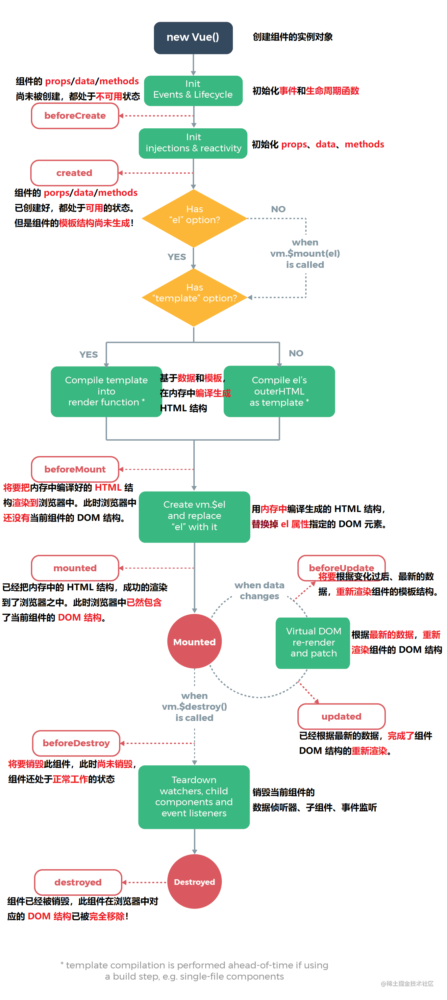

# 子组件在create、mounted中接受不到父组件传来的异步数据

## 参考资料

1. vue中父组件异步数据通过props方式传递给子组件，子组件接收不到的问题 [https://blog.csdn.net/weixin_43290151/article/details/124954767]
2. Vue生命周期详解 [https://blog.csdn.net/weixin_45054614/article/details/122178368]


## 问题来源

最近在写项目结构时候遇到了这个问题，项目结构如下：父组件地理信息/index.js中包含三个子组件：区域组件、省份组件、城市组件。

需求：在index.js中通过后端接口获取所有区域信息、再遍历每个区域，获取区域下的省份，组成所有省份信息。将所有区域信息传递给省份组件用于显示每个区域下有哪些省份，所有省份信息传递给城市组件用于显示每个省份下有哪些城市。遇到了问题：城市组件在页面渲染时候获取不到父组件传来的数据。

## 问题原因

由于所有省份信息是在index.js页面以后端请求的方式异步获取的，根据父子组件的生命周期流程，父组件要等子组件的生命周期走完，即子组件mounted完后，父组件才会mounted。而mounted钩子默认加载只会执行一次，子组件的mounted钩子执行的时候，父组件的异步数据还没有传递过来。


## 问题解决

#### 方案一 使用v-if控制子组件渲染的时机

##### 父组件

~~~html
<el-tab-pane label="城市信息管理" name="third">
            <City v-if="allprovinces.length !== 0" :allprovinces="allprovinces" />
</el-tab-pane>
~~~

##### 子组件

>  这种方式，子组件不用动代码，在父组件中去做控制即可

但是这种方式有一个小小的缺点，就是最终效果会显得组件有些延迟才出现效果。因为异步数据是从后端的接口获取的，如果接口时间长一些的话，最终效果渲染也会慢一点，但是！！！一般情况下，后端的接口速度都会控制在几十到几百毫秒的时间，一般情况下，不会出现好几秒，甚至几十秒的接口，所以瑕不掩瑜，这种方式不影响我们使用


#### 方案二 子组件使用watch监听父组件传递过来的数据

##### 父组件

这种方式父组件正常传递数据即可，不需要做什么代码处理，只要在子组件中加一个监听即可

##### 子组件

~~~javascript
<script>
export default {
  props: {
    allprovince: {
      type: Array,
      default: null,
    },
  },
  watch: {
    // 监听到父组件传递过来的数据后，加工一下，
    // 存到data中去，然后在页面上使用
    allprovince(newnew, oldold) {
      console.log("监听", newnew, oldold)
      this.allprovince_total = newnew
    },
  },
  data() {
    return {
      allprovince_total: [],
    };
  },
};
</script>
~~~

## 相关知识

### Vue生命周期



### 父子组件生命周期执行顺序

加载渲染数据过程

```
父组件 beforeCreate -->
父组件 created -->
父组件 beforeMount -->
子组件 beforeCreate -->
子组件 created -->
子组件 beforeMount -->
子组件 mounted -->
父组件 mounted -->
```

更新渲染数据过程

```
父组件 beforeUpdate -->
子组件 beforeUpdate -->
子组件 updated -->
父组件 updated -->
```

销毁组件数据过程

~~~
父组件 beforeDestroy -->
子组件 beforeDestroy -->
子组件 destroyed -->
父组件 destroyed
~~~

可以这样理解，父组件生命周期中会先看看子组件的生命周期有没有走完，`子组件生命周期走完了，才会走完父组件的生命周期`。
